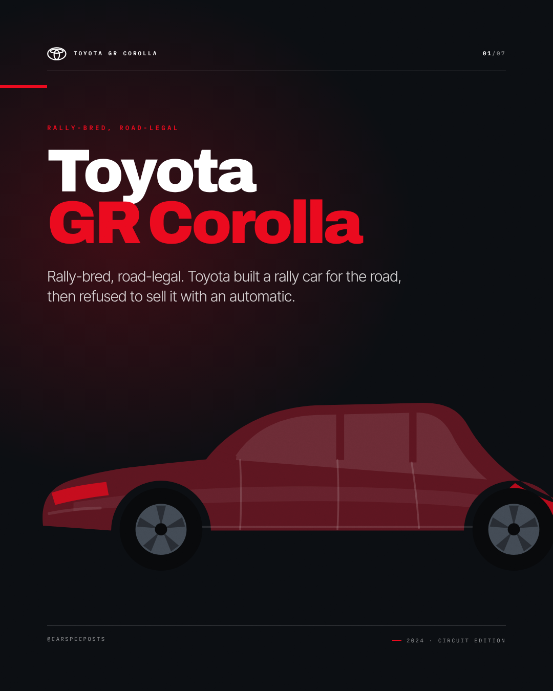
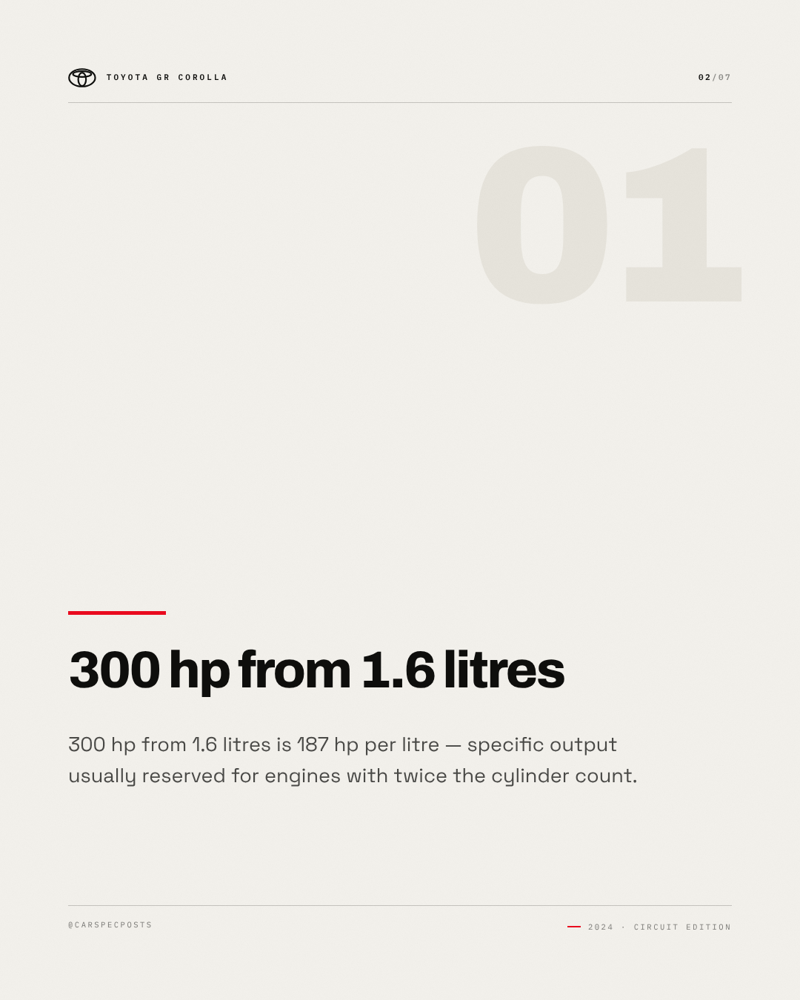
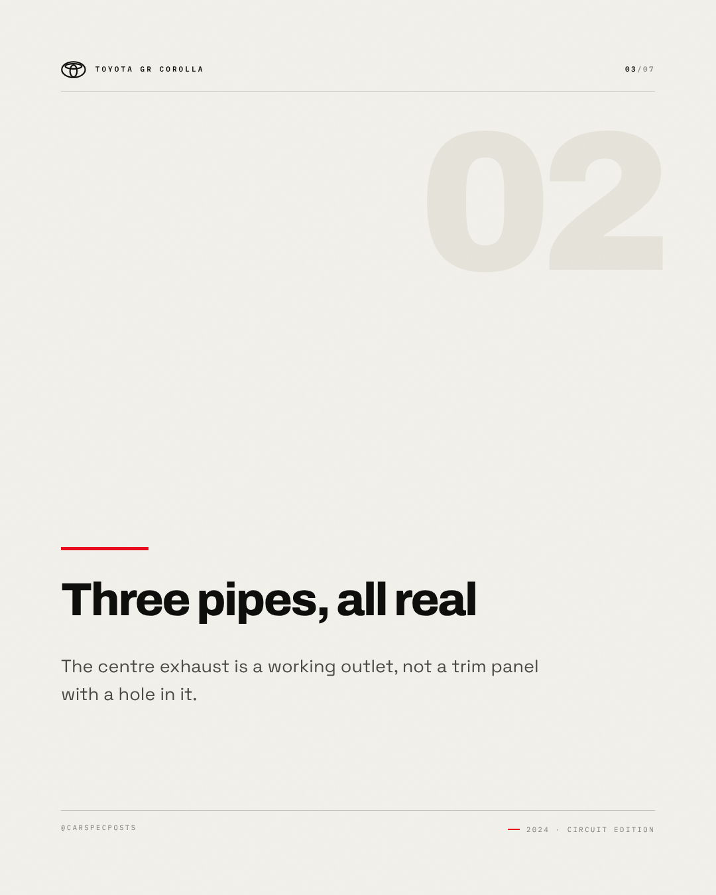
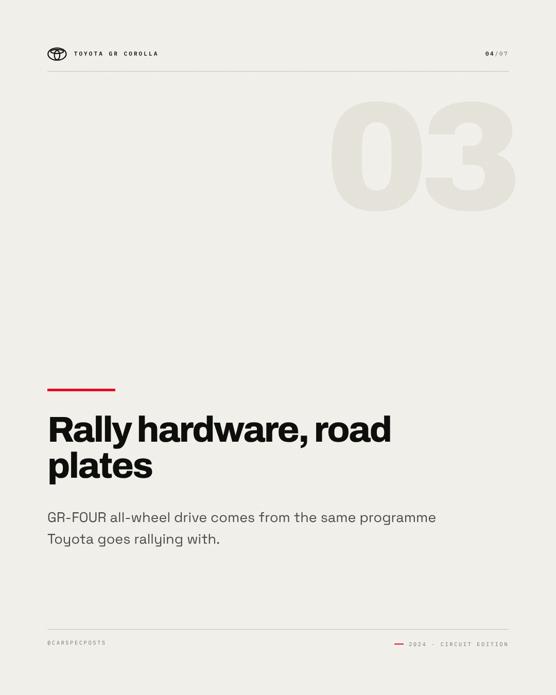
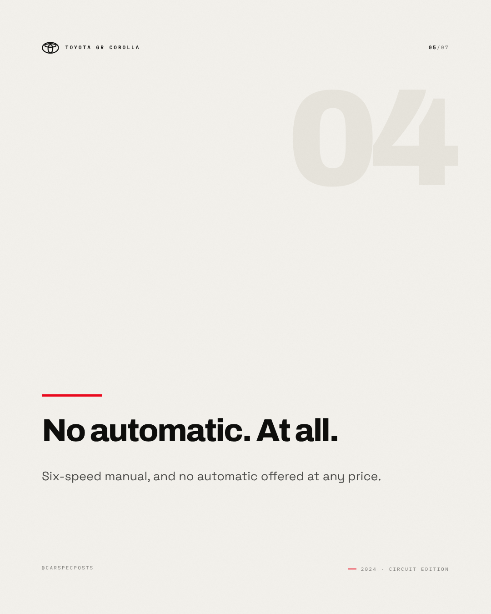
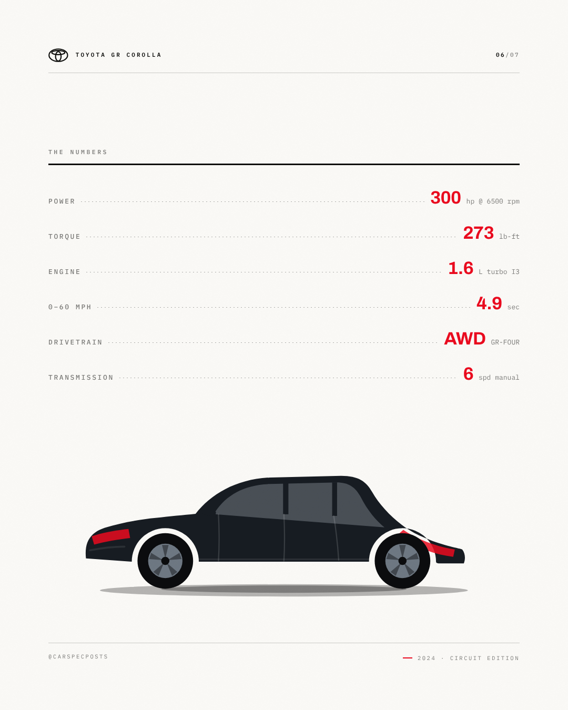
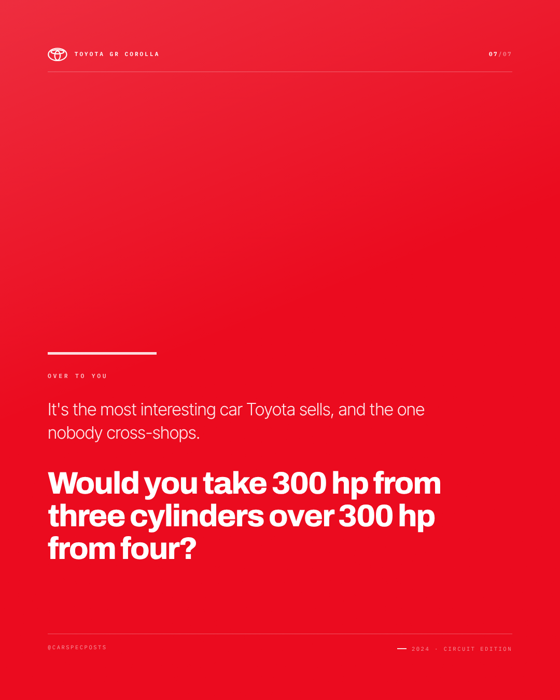

# Toyota GR Corolla — Instagram carousel

7 slides, 1080×1350 each, in order.

### Slide 1 — Toyota GR Corolla

Rally-bred, road-legal. Toyota built a rally car for the road, then refused to sell it with an automatic.

*Visual direction.* Cover: silhouette running off the right edge on the accent field, model name at slide scale, kicker as tracked caps above it.

### Slide 2 — 300 hp from 1.6 litres

300 hp from 1.6 litres is 187 hp per litre — specific output usually reserved for engines with twice the cylinder count.

*Visual direction.* Point 1 of 4: heading at display scale over a hairline rule, body set narrow, slide index in the corner.

### Slide 3 — Three pipes, all real

The centre exhaust is a working outlet, not a trim panel with a hole in it.

*Visual direction.* Point 2 of 4: heading at display scale over a hairline rule, body set narrow, slide index in the corner.

### Slide 4 — Rally hardware, road plates

GR-FOUR all-wheel drive comes from the same programme Toyota goes rallying with.

*Visual direction.* Point 3 of 4: heading at display scale over a hairline rule, body set narrow, slide index in the corner.

### Slide 5 — No automatic. At all.

Six-speed manual, and no automatic offered at any price.

*Visual direction.* Point 4 of 4: heading at display scale over a hairline rule, body set narrow, slide index in the corner.

### Slide 6 — The numbers

300 hp / 273 lb-ft / 1.6 L turbo I3 / 0–60 mph in 4.9 sec / AWD GR-FOUR / 6 spd manual

*Visual direction.* Full spec table, dotted leaders, values in the accent colour.

### Slide 7 — Over to you

It's the most interesting car Toyota sells, and the one nobody cross-shops. Would you take 300 hp from three cylinders over 300 hp from four?

*Visual direction.* Closer: accent field, question at display scale, handle in tracked caps at the foot.

## Review

- [x] Carousel of 5–10 slides — 7 slides
- [x] Slide titles within 34 characters — all slides
- [x] Slide bodies within 200 characters — all slides

### Read these yourself

- [ ] The hook earns the second line
- [ ] The tone reads as the effective tone above, not as the house voice
- [ ] Nothing here needs the poster in front of you to make sense
