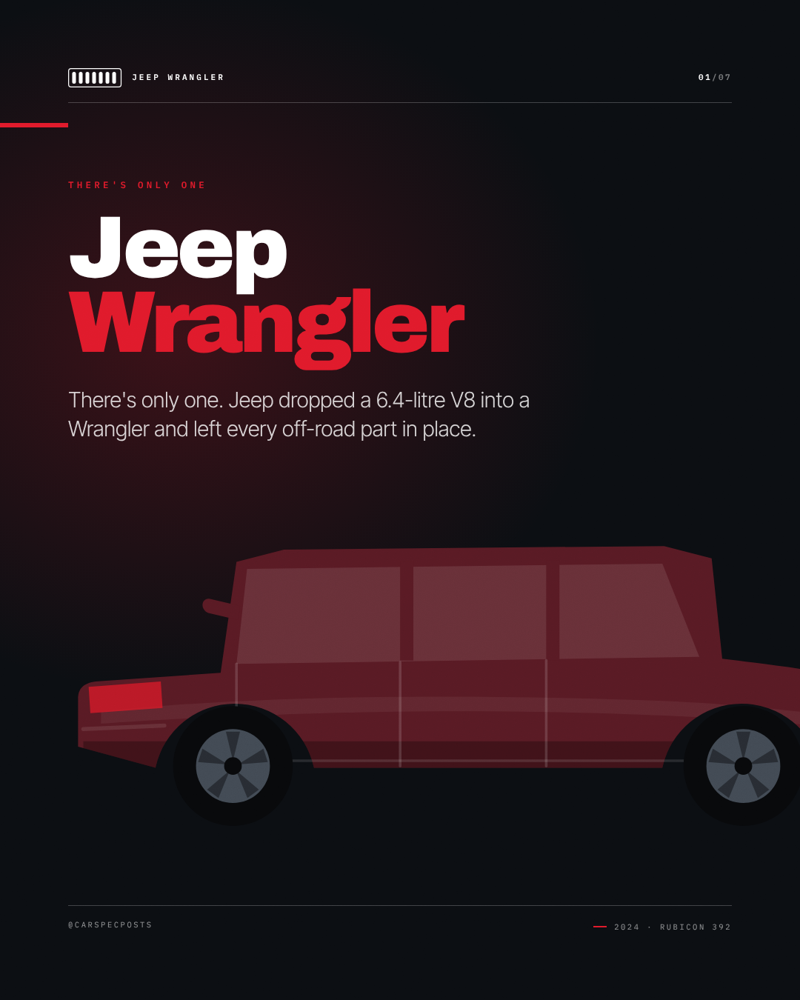
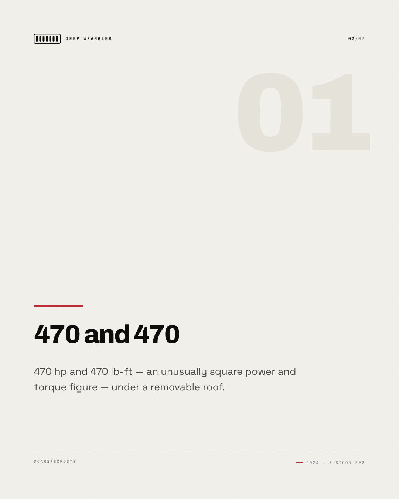
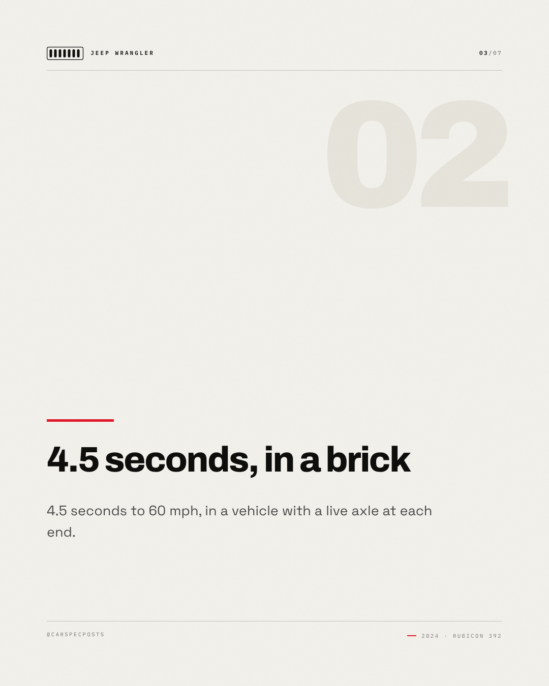
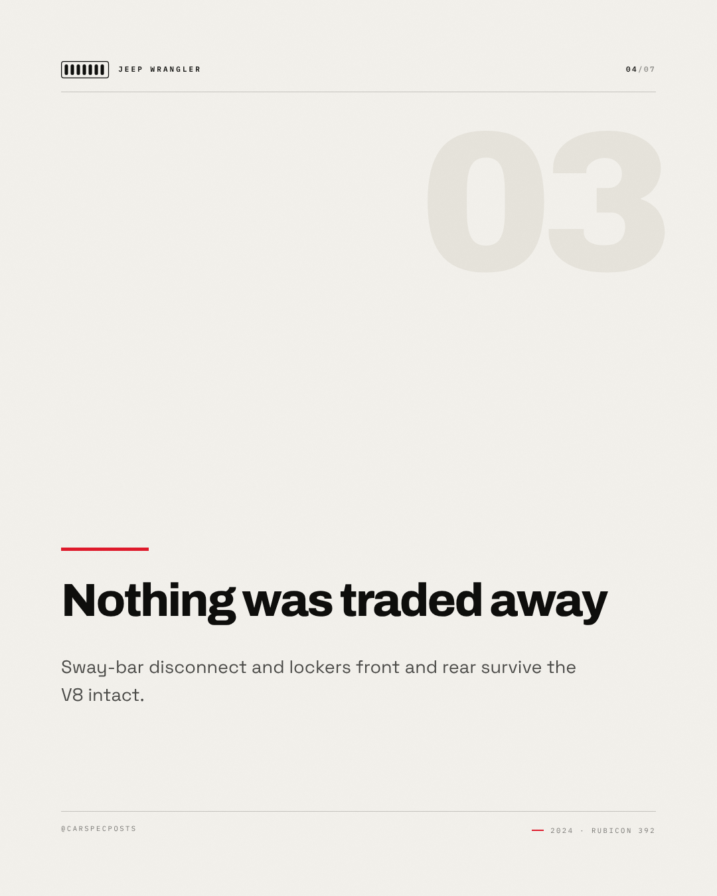
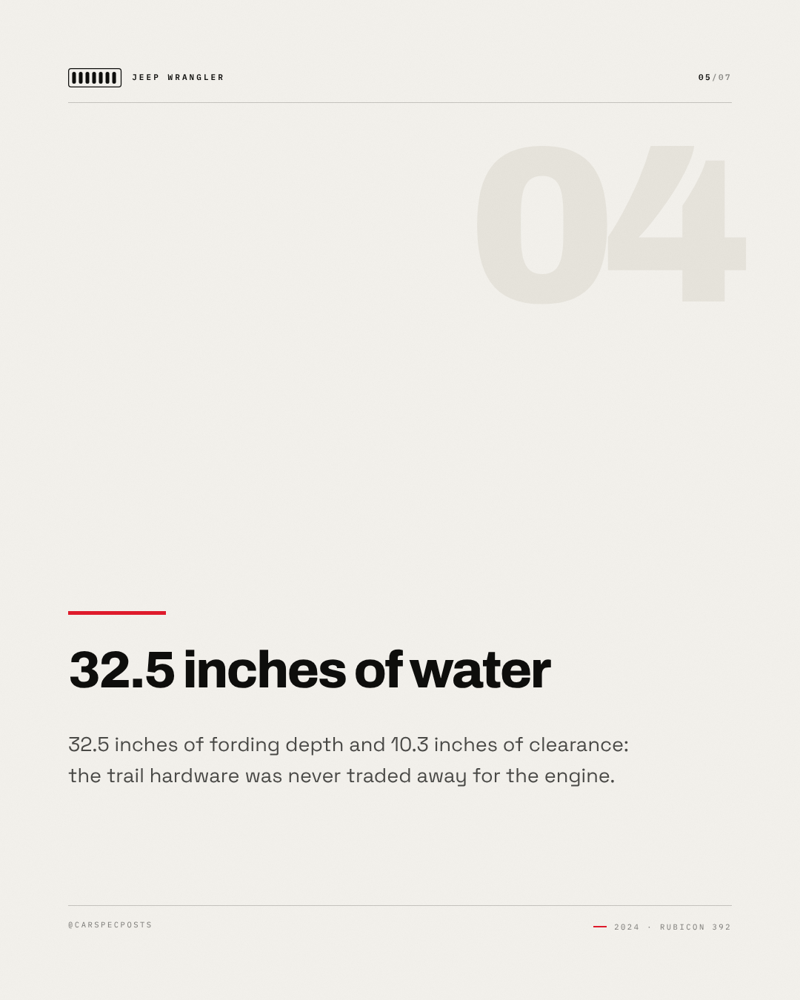
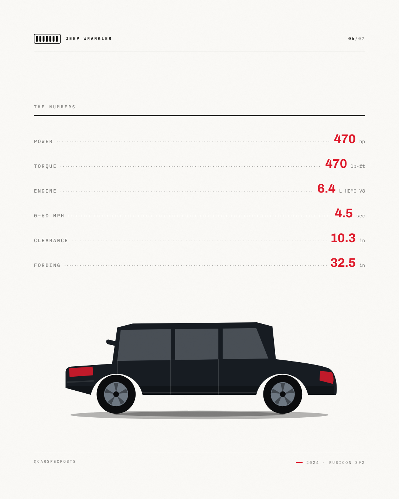
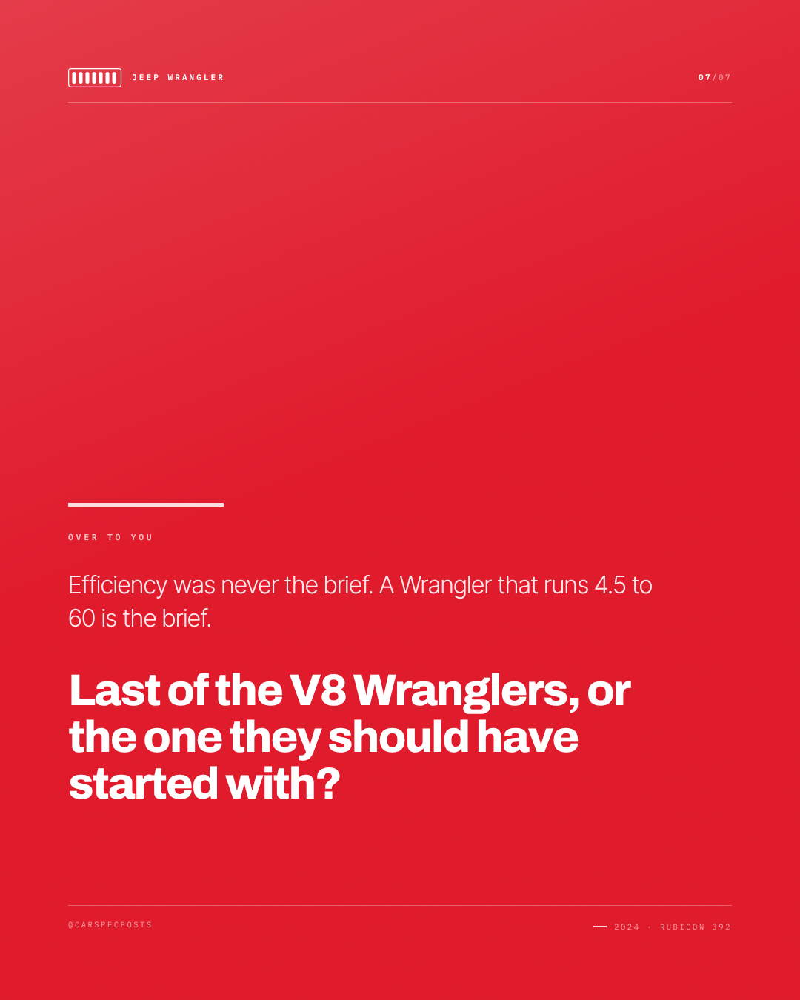

# Jeep Wrangler — Instagram carousel

7 slides, 1080×1350 each, in order.

### Slide 1 — Jeep Wrangler

There's only one. Jeep dropped a 6.4-litre V8 into a Wrangler and left every off-road part in place.

*Visual direction.* Cover: silhouette running off the right edge on the accent field, model name at slide scale, kicker as tracked caps above it.

### Slide 2 — 470 and 470

470 hp and 470 lb-ft — an unusually square power and torque figure — under a removable roof.

*Visual direction.* Point 1 of 4: heading at display scale over a hairline rule, body set narrow, slide index in the corner.

### Slide 3 — 4.5 seconds, in a brick

4.5 seconds to 60 mph, in a vehicle with a live axle at each end.

*Visual direction.* Point 2 of 4: heading at display scale over a hairline rule, body set narrow, slide index in the corner.

### Slide 4 — Nothing was traded away

Sway-bar disconnect and lockers front and rear survive the V8 intact.

*Visual direction.* Point 3 of 4: heading at display scale over a hairline rule, body set narrow, slide index in the corner.

### Slide 5 — 32.5 inches of water

32.5 inches of fording depth and 10.3 inches of clearance: the trail hardware was never traded away for the engine.

*Visual direction.* Point 4 of 4: heading at display scale over a hairline rule, body set narrow, slide index in the corner.

### Slide 6 — The numbers

470 hp / 470 lb-ft / 6.4 L HEMI V8 / 0–60 mph in 4.5 sec / 10.3 in / 32.5 in

*Visual direction.* Full spec table, dotted leaders, values in the accent colour.

### Slide 7 — Over to you

Efficiency was never the brief. A Wrangler that runs 4.5 to 60 is the brief. Last of the V8 Wranglers, or the one they should have started with?

*Visual direction.* Closer: accent field, question at display scale, handle in tracked caps at the foot.

## Review

- [x] Carousel of 5–10 slides — 7 slides
- [x] Slide titles within 34 characters — all slides
- [x] Slide bodies within 200 characters — all slides

### Read these yourself

- [ ] The hook earns the second line
- [ ] The tone reads as the effective tone above, not as the house voice
- [ ] Nothing here needs the poster in front of you to make sense
