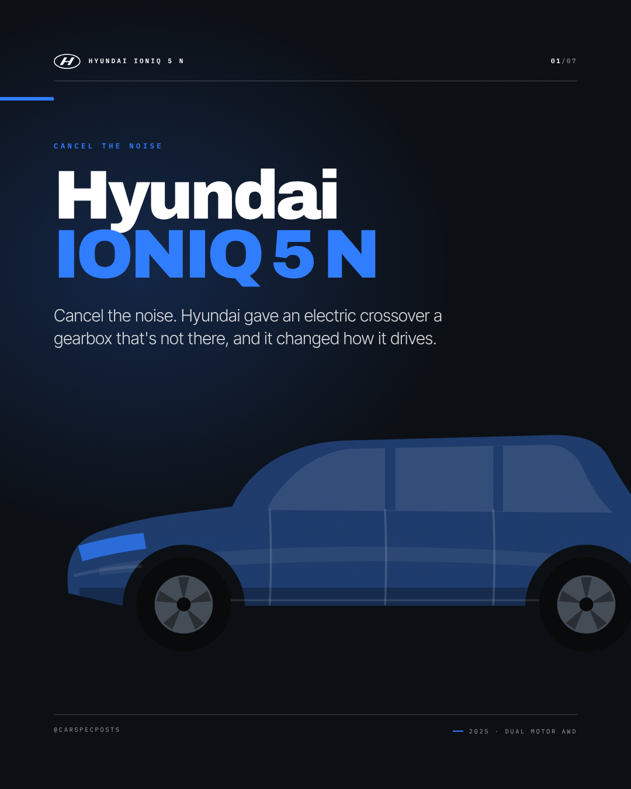
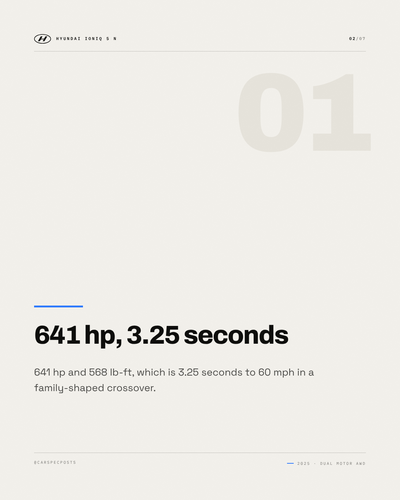
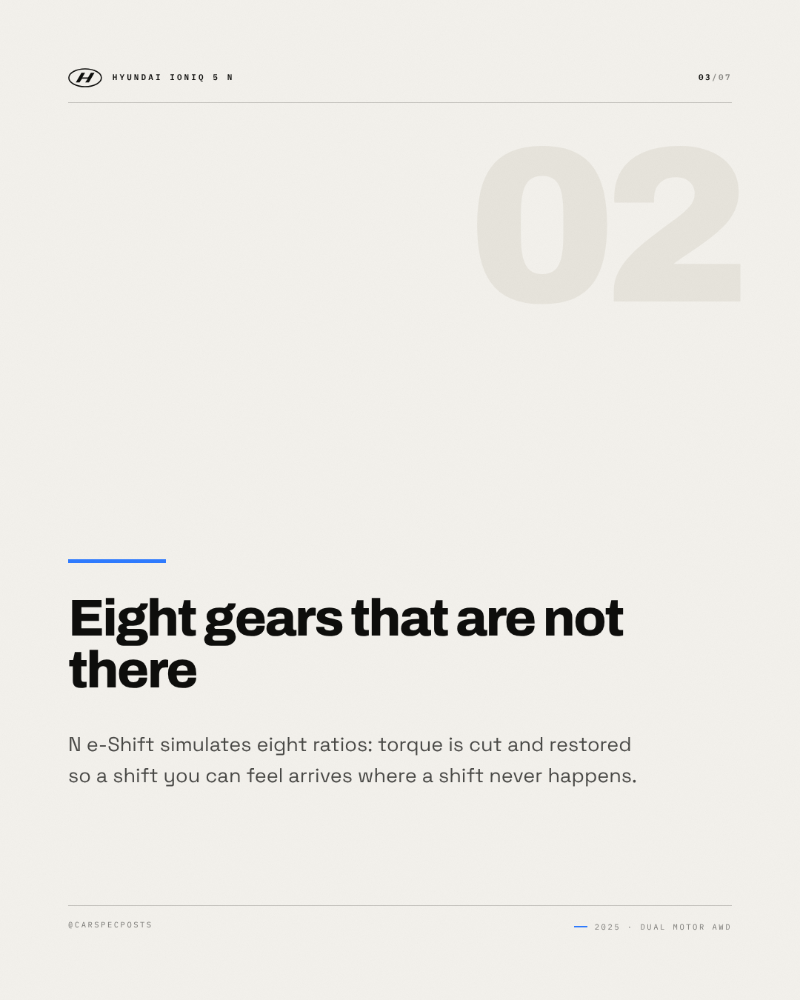
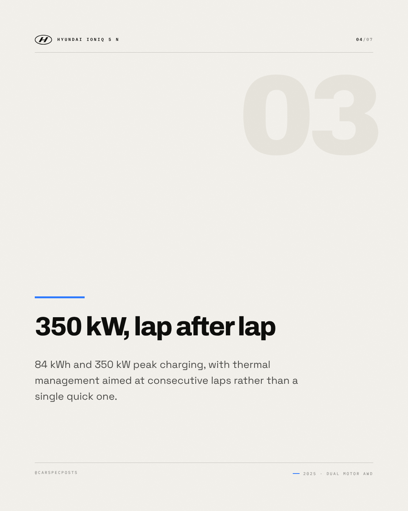
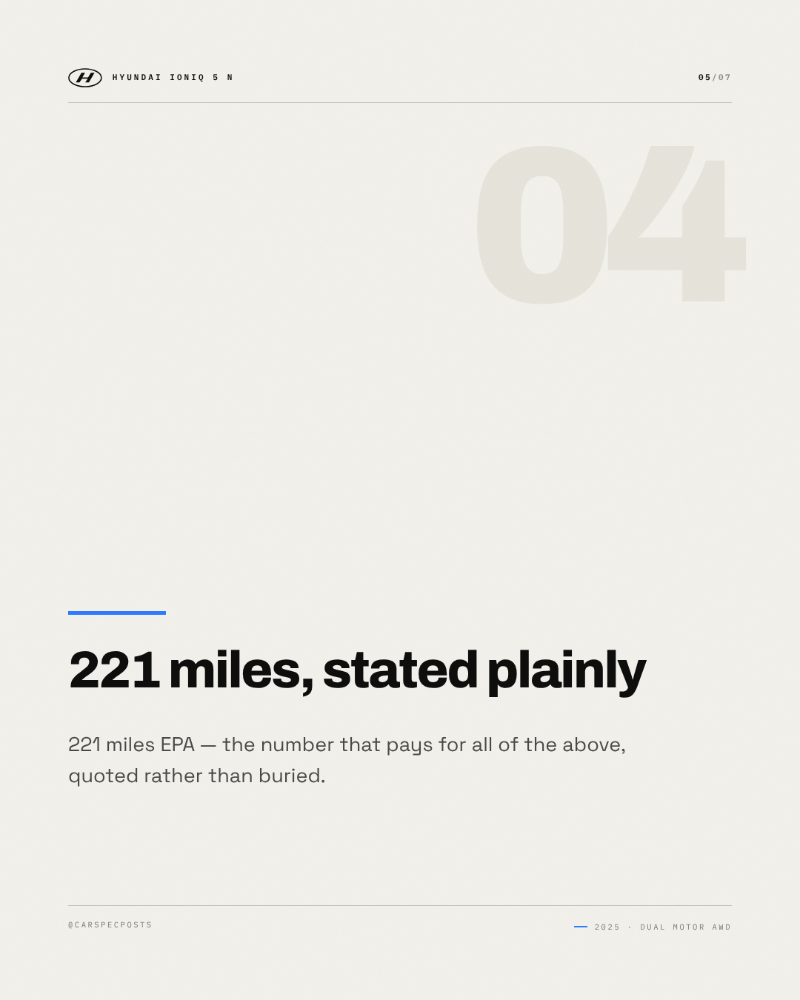
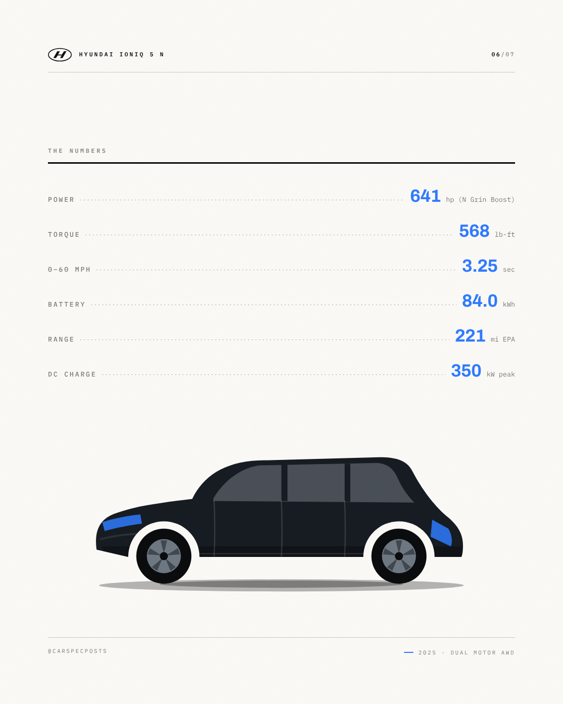
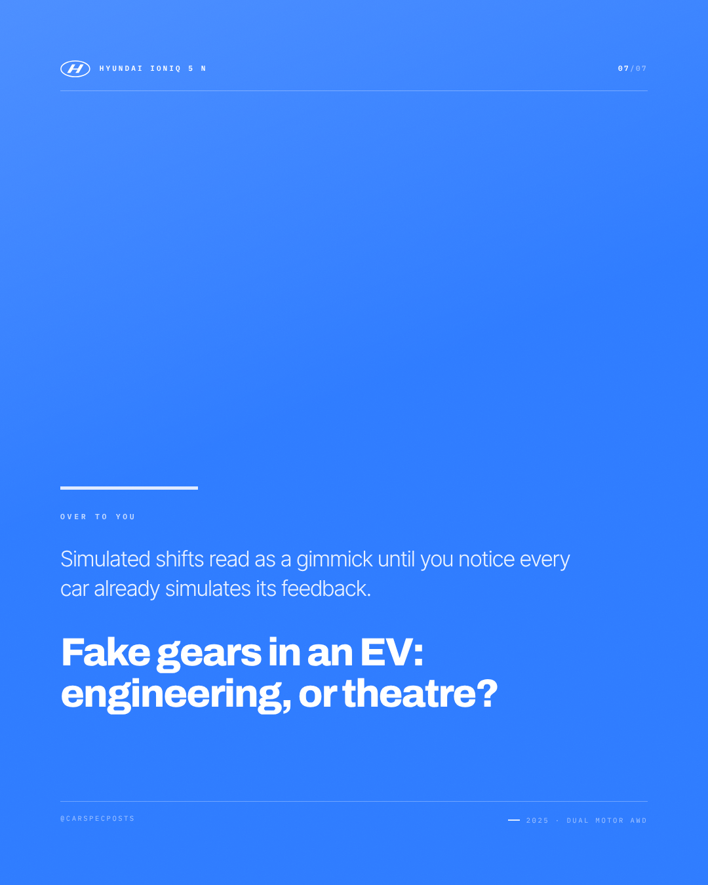

# Hyundai IONIQ 5 N — Instagram carousel

7 slides, 1080×1350 each, in order.

### Slide 1 — Hyundai IONIQ 5 N

Cancel the noise. Hyundai gave an electric crossover a gearbox that's not there, and it changed how it drives.

*Visual direction.* Cover: silhouette running off the right edge on the accent field, model name at slide scale, kicker as tracked caps above it.

### Slide 2 — 641 hp, 3.25 seconds

641 hp and 568 lb-ft, which is 3.25 seconds to 60 mph in a family-shaped crossover.

*Visual direction.* Point 1 of 4: heading at display scale over a hairline rule, body set narrow, slide index in the corner.

### Slide 3 — Eight gears that are not there

N e-Shift simulates eight ratios: torque is cut and restored so a shift you can feel arrives where a shift never happens.

*Visual direction.* Point 2 of 4: heading at display scale over a hairline rule, body set narrow, slide index in the corner.

### Slide 4 — 350 kW, lap after lap

84 kWh and 350 kW peak charging, with thermal management aimed at consecutive laps rather than a single quick one.

*Visual direction.* Point 3 of 4: heading at display scale over a hairline rule, body set narrow, slide index in the corner.

### Slide 5 — 221 miles, stated plainly

221 miles EPA — the number that pays for all of the above, quoted rather than buried.

*Visual direction.* Point 4 of 4: heading at display scale over a hairline rule, body set narrow, slide index in the corner.

### Slide 6 — The numbers

641 hp / 568 lb-ft / 0–60 mph in 3.25 sec / 84.0 kWh / 221 mi EPA / 350 kW peak

*Visual direction.* Full spec table, dotted leaders, values in the accent colour.

### Slide 7 — Over to you

Simulated shifts read as a gimmick until you notice every car already simulates its feedback. Fake gears in an EV: engineering, or theatre?

*Visual direction.* Closer: accent field, question at display scale, handle in tracked caps at the foot.

## Review

- [x] Carousel of 5–10 slides — 7 slides
- [x] Slide titles within 34 characters — all slides
- [x] Slide bodies within 200 characters — all slides

### Read these yourself

- [ ] The hook earns the second line
- [ ] The tone reads as the effective tone above, not as the house voice
- [ ] Nothing here needs the poster in front of you to make sense
