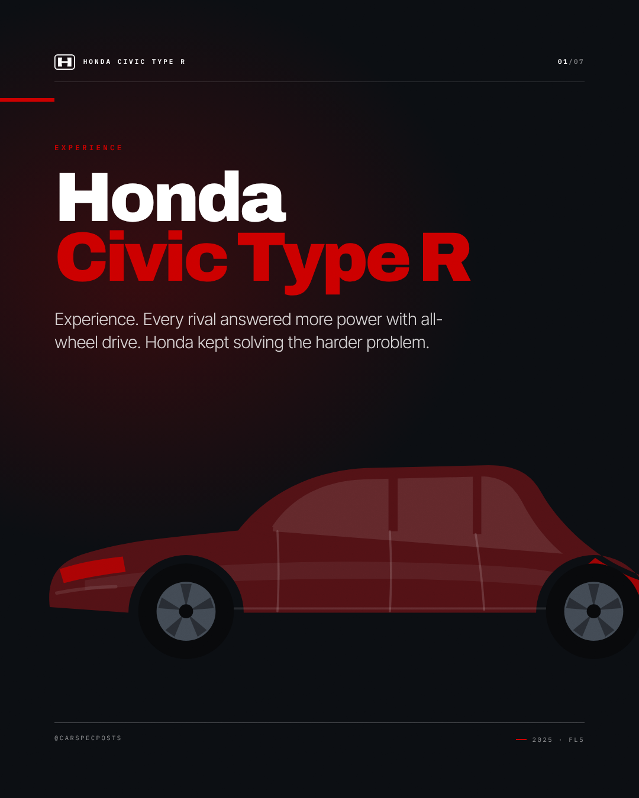
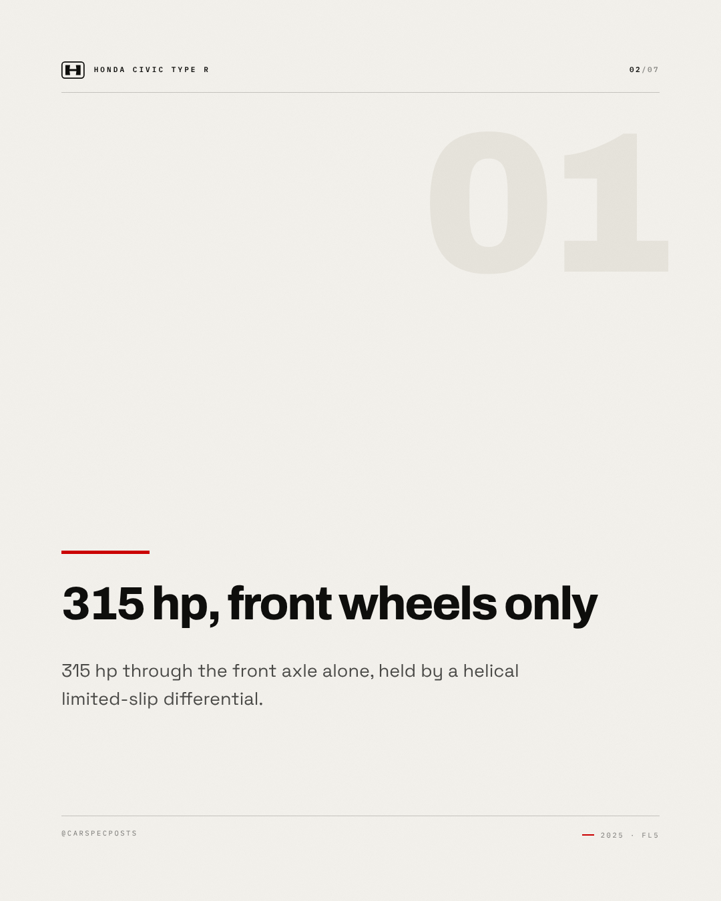
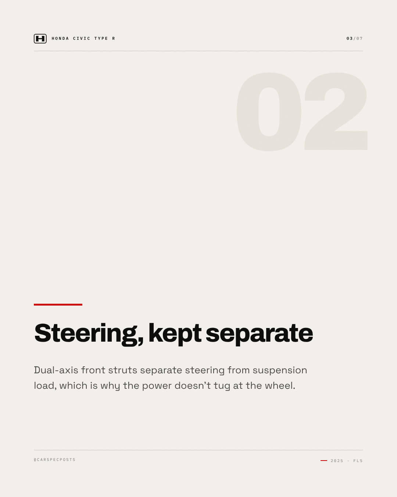
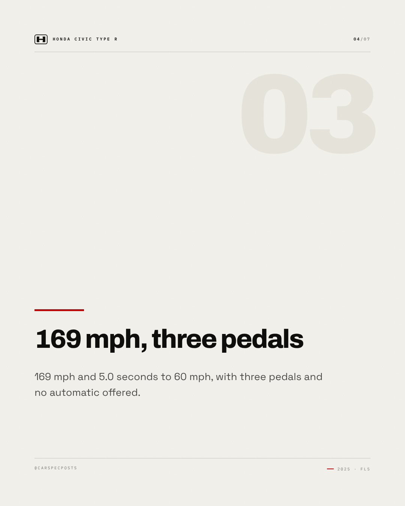
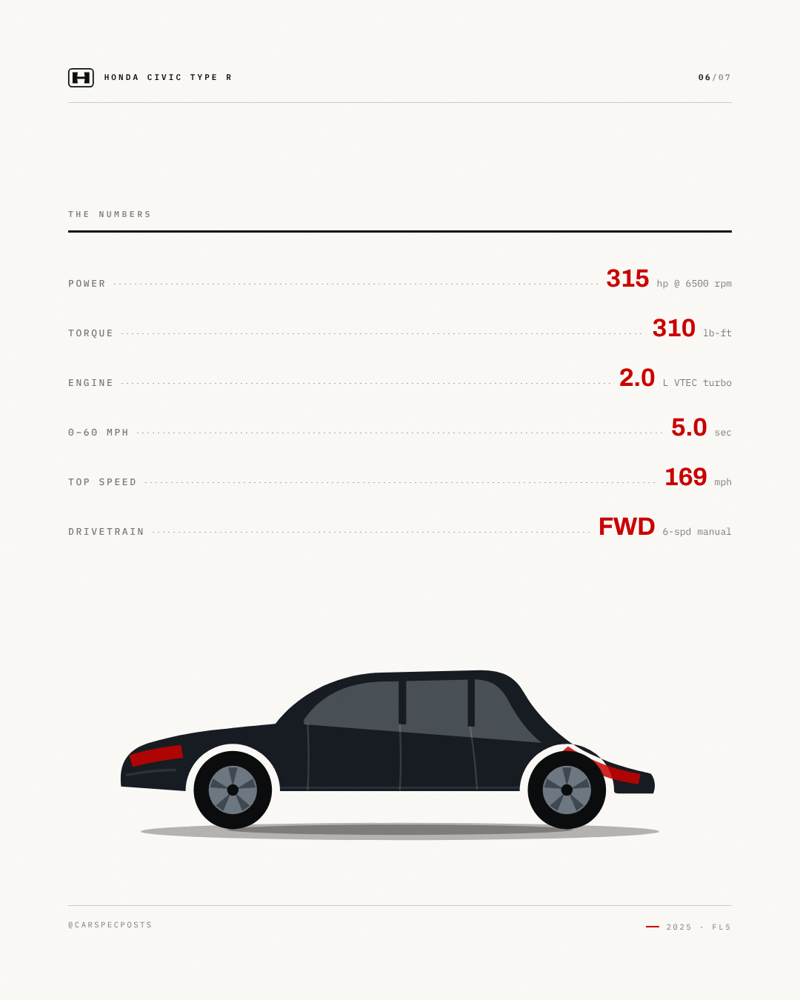
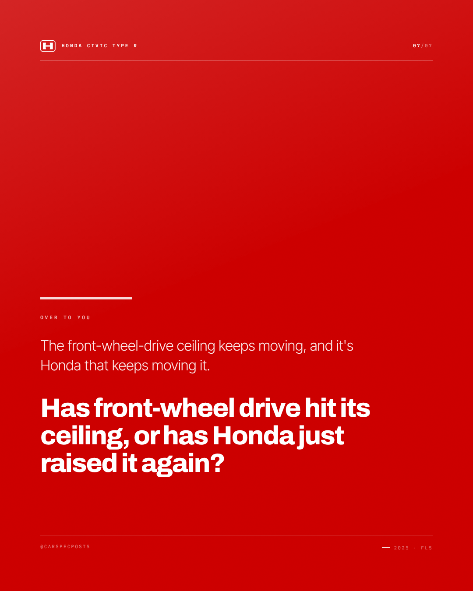

# Honda Civic Type R — Instagram carousel

7 slides, 1080×1350 each, in order.

### Slide 1 — Honda Civic Type R

Experience. Every rival answered more power with all-wheel drive. Honda kept solving the harder problem.

*Visual direction.* Cover: silhouette running off the right edge on the accent field, model name at slide scale, kicker as tracked caps above it.

### Slide 2 — 315 hp, front wheels only

315 hp through the front axle alone, held by a helical limited-slip differential.

*Visual direction.* Point 1 of 4: heading at display scale over a hairline rule, body set narrow, slide index in the corner.

### Slide 3 — Steering, kept separate

Dual-axis front struts separate steering from suspension load, which is why the power doesn't tug at the wheel.

*Visual direction.* Point 2 of 4: heading at display scale over a hairline rule, body set narrow, slide index in the corner.

### Slide 4 — 169 mph, three pedals

169 mph and 5.0 seconds to 60 mph, with three pedals and no automatic offered.

*Visual direction.* Point 3 of 4: heading at display scale over a hairline rule, body set narrow, slide index in the corner.

### Slide 5 — Tuned at the Nürburgring

Damping developed at the Nürburgring, and a rev-match you are allowed to switch off.

*Visual direction.* Point 4 of 4: heading at display scale over a hairline rule, body set narrow, slide index in the corner.

### Slide 6 — The numbers

315 hp / 310 lb-ft / 2.0 L VTEC turbo / 0–60 mph in 5.0 sec / 169 mph / FWD 6-spd manual

*Visual direction.* Full spec table, dotted leaders, values in the accent colour.

### Slide 7 — Over to you

The front-wheel-drive ceiling keeps moving, and it's Honda that keeps moving it. Has front-wheel drive hit its ceiling, or has Honda just raised it again?

*Visual direction.* Closer: accent field, question at display scale, handle in tracked caps at the foot.

## Review

- [x] Carousel of 5–10 slides — 7 slides
- [x] Slide titles within 34 characters — all slides
- [x] Slide bodies within 200 characters — all slides

### Read these yourself

- [ ] The hook earns the second line
- [ ] The tone reads as the effective tone above, not as the house voice
- [ ] Nothing here needs the poster in front of you to make sense
