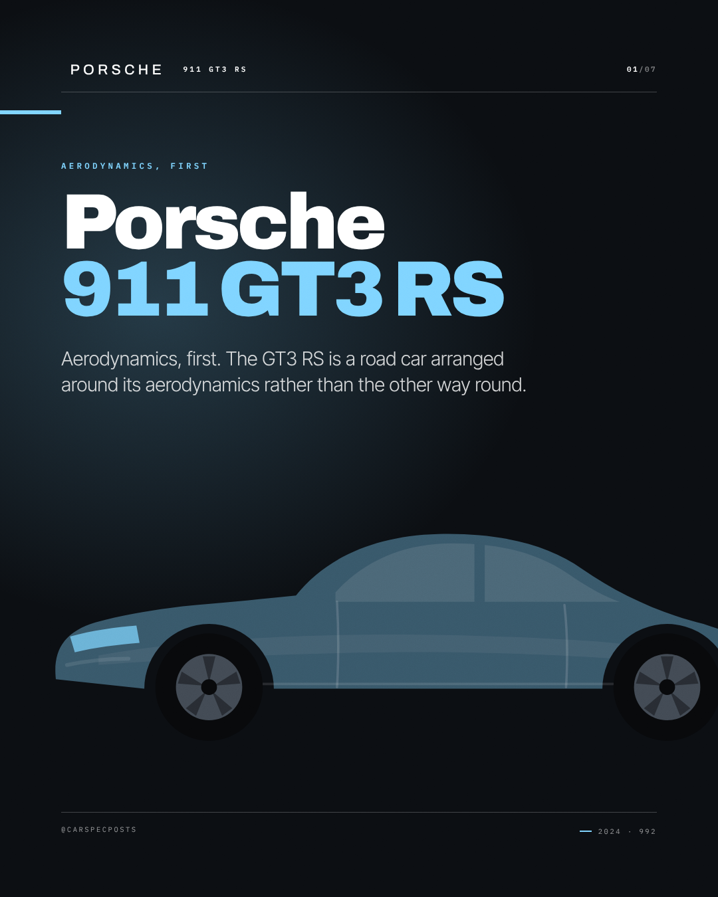
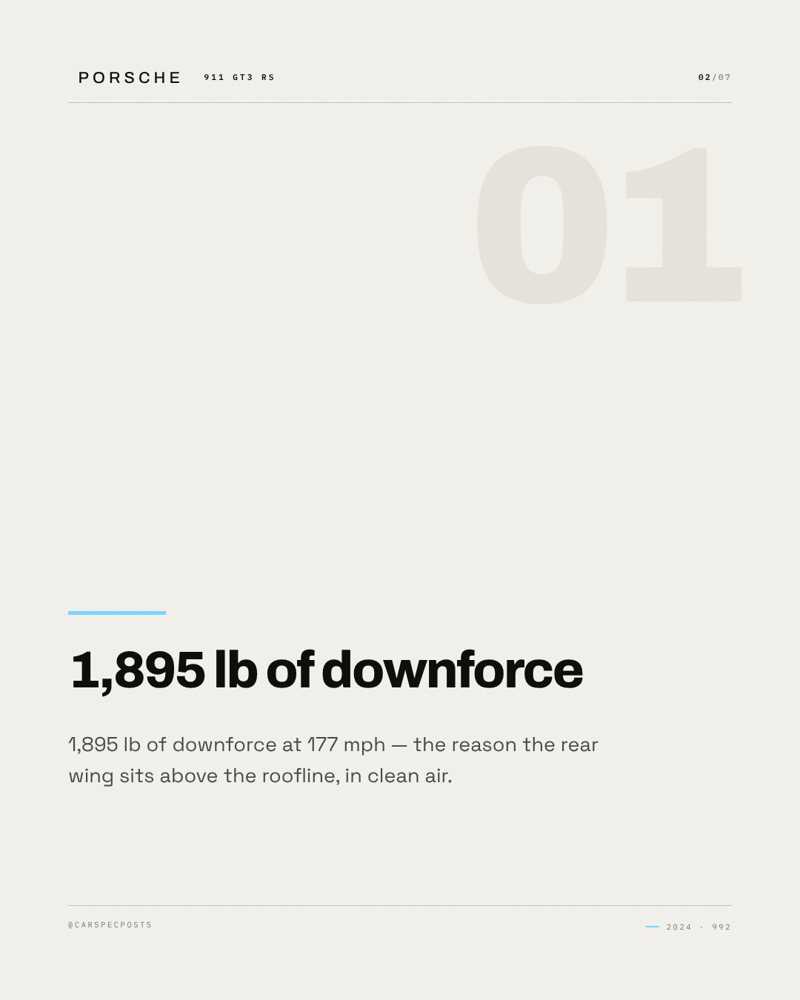
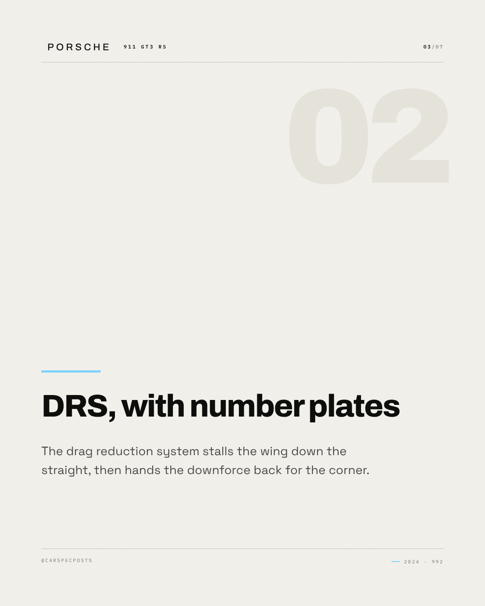
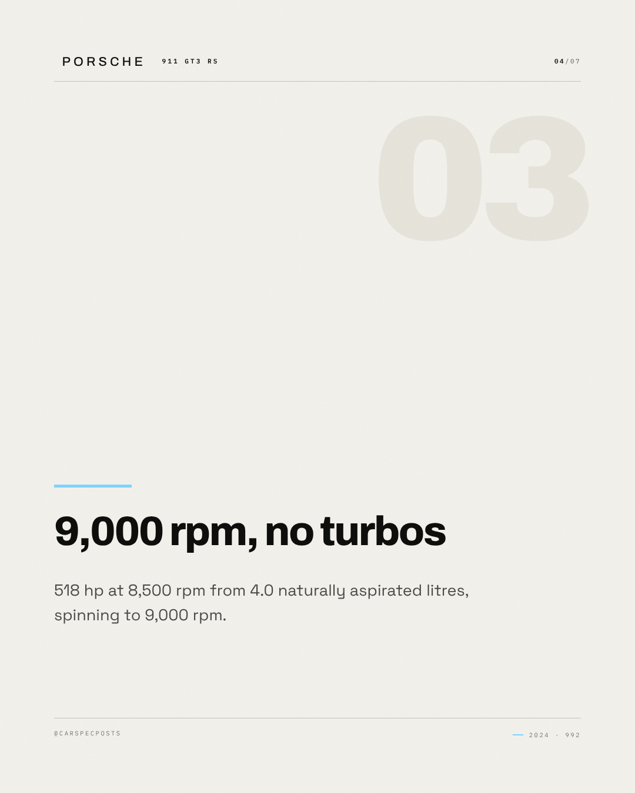
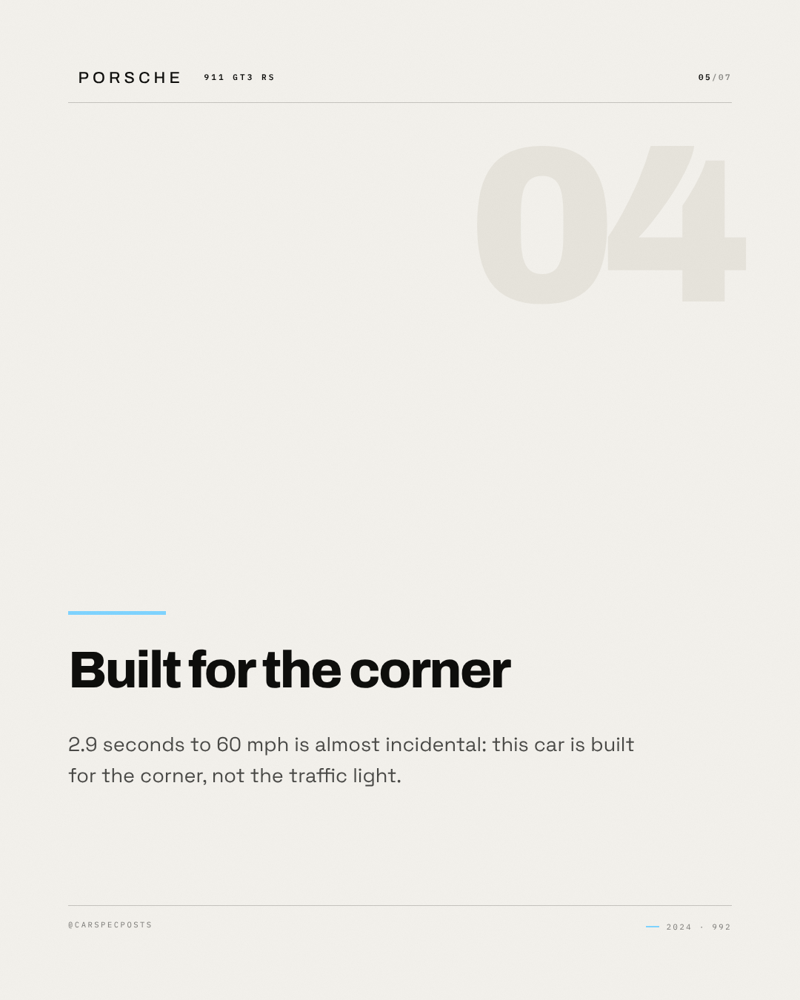
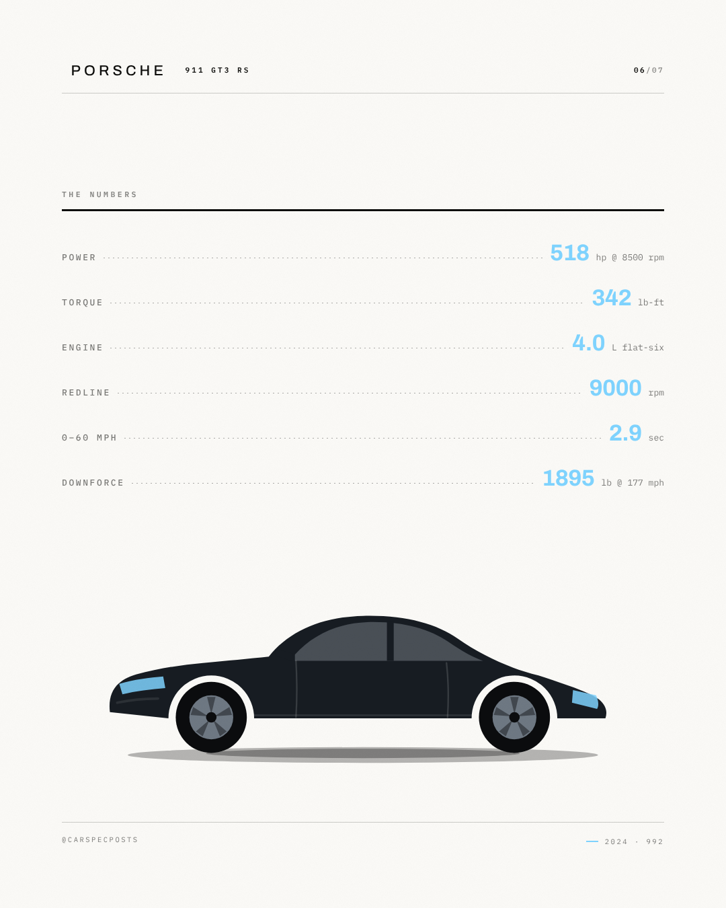
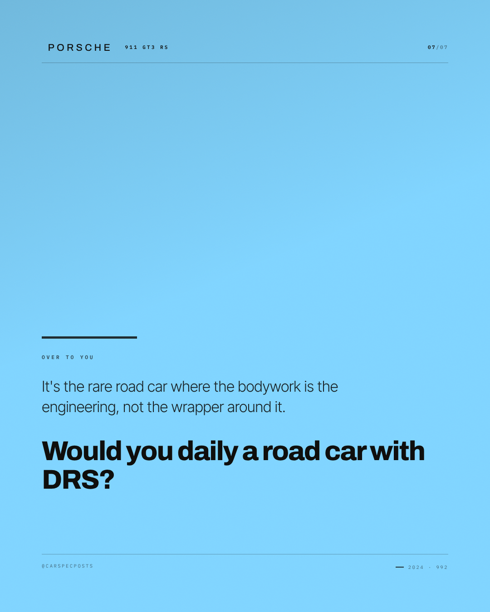

# Porsche 911 GT3 RS — Instagram carousel

7 slides, 1080×1350 each, in order.

### Slide 1 — Porsche 911 GT3 RS

Aerodynamics, first. The GT3 RS is a road car arranged around its aerodynamics rather than the other way round.

*Visual direction.* Cover: silhouette running off the right edge on the accent field, model name at slide scale, kicker as tracked caps above it.

### Slide 2 — 1,895 lb of downforce

1,895 lb of downforce at 177 mph — the reason the rear wing sits above the roofline, in clean air.

*Visual direction.* Point 1 of 4: heading at display scale over a hairline rule, body set narrow, slide index in the corner.

### Slide 3 — DRS, with number plates

The drag reduction system stalls the wing down the straight, then hands the downforce
        back for the corner.

*Visual direction.* Point 2 of 4: heading at display scale over a hairline rule, body set narrow, slide index in the corner.

### Slide 4 — 9,000 rpm, no turbos

518 hp at 8,500 rpm from 4.0 naturally aspirated litres, spinning to 9,000 rpm.

*Visual direction.* Point 3 of 4: heading at display scale over a hairline rule, body set narrow, slide index in the corner.

### Slide 5 — Built for the corner

2.9 seconds to 60 mph is almost incidental: this car is built for the corner, not the traffic light.

*Visual direction.* Point 4 of 4: heading at display scale over a hairline rule, body set narrow, slide index in the corner.

### Slide 6 — The numbers

518 hp / 342 lb-ft / 4.0 L flat-six / 9000 rpm / 0–60 mph in 2.9 sec / 1895 lb

*Visual direction.* Full spec table, dotted leaders, values in the accent colour.

### Slide 7 — Over to you

It's the rare road car where the bodywork is the engineering, not the wrapper around it. Would you daily a road car with DRS?

*Visual direction.* Closer: accent field, question at display scale, handle in tracked caps at the foot.

## Review

- [x] Carousel of 5–10 slides — 7 slides
- [x] Slide titles within 34 characters — all slides
- [x] Slide bodies within 200 characters — all slides

### Read these yourself

- [ ] The hook earns the second line
- [ ] The tone reads as the effective tone above, not as the house voice
- [ ] Nothing here needs the poster in front of you to make sense
