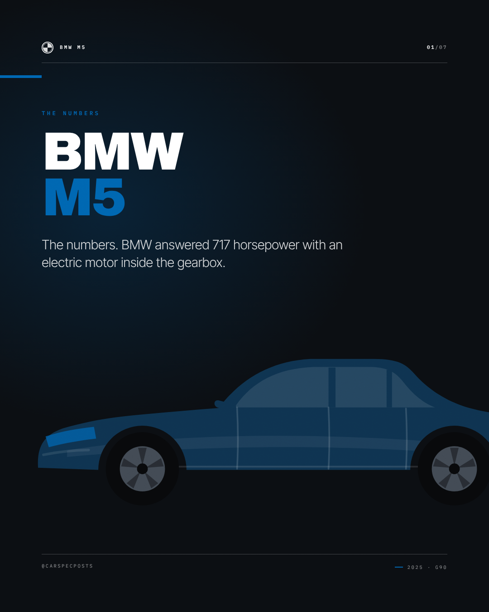
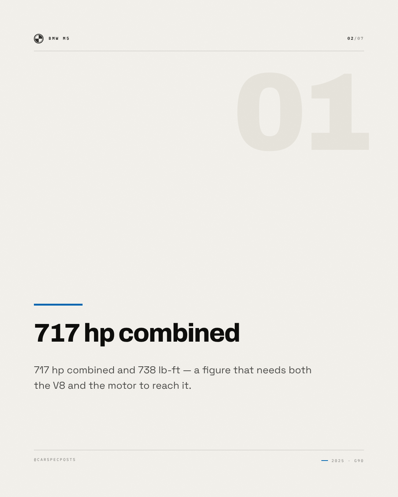
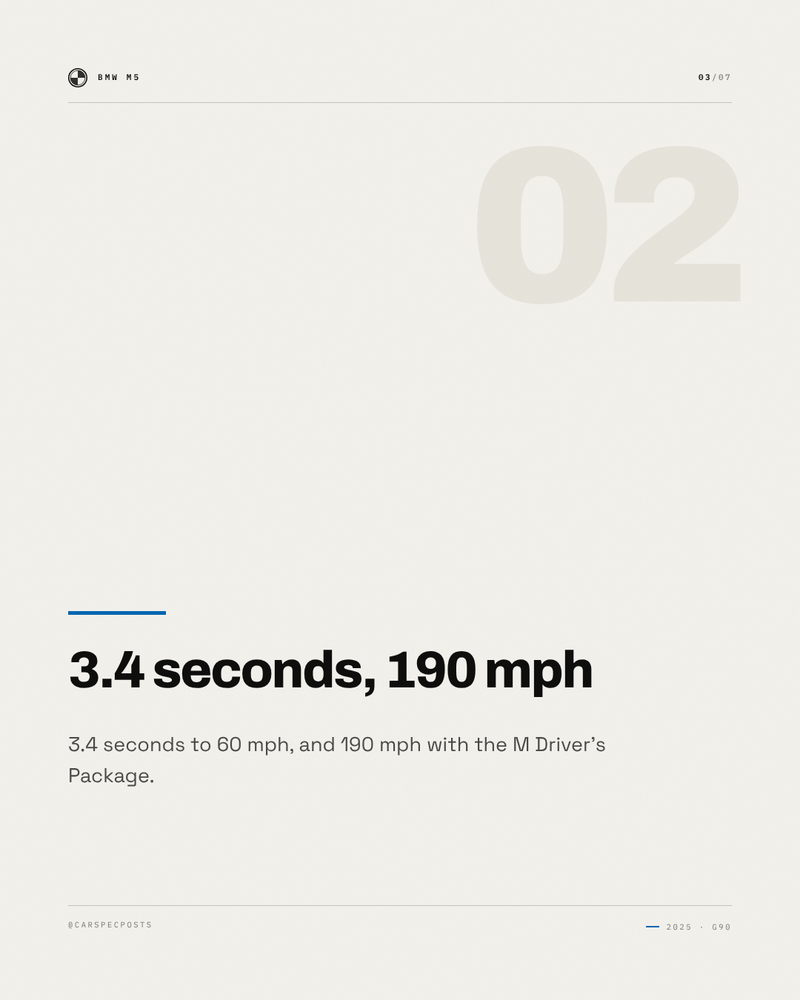
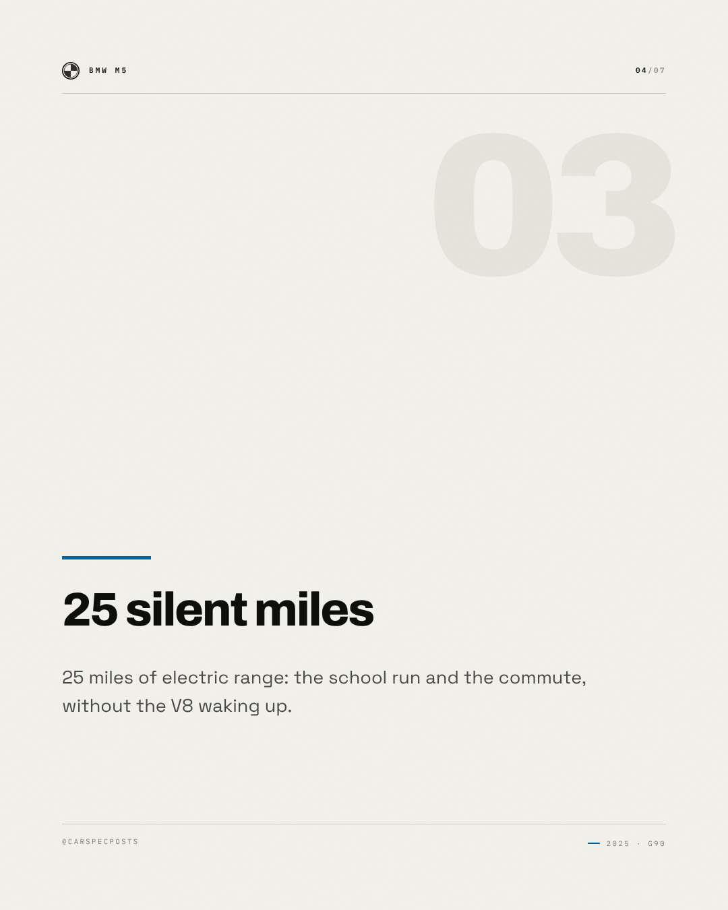
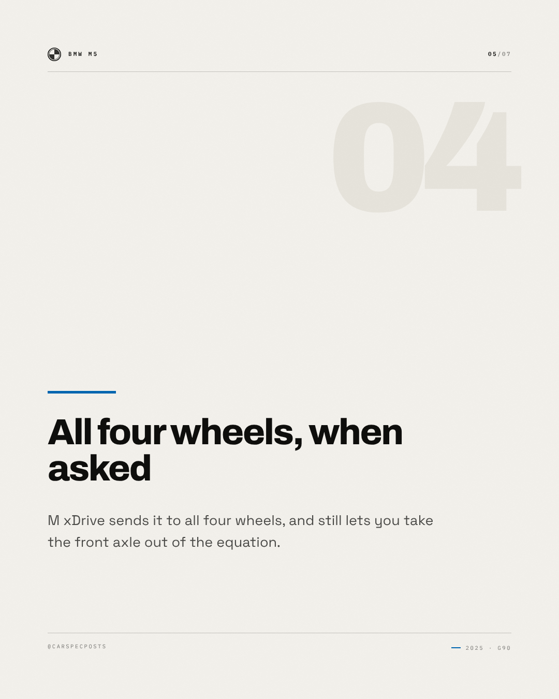
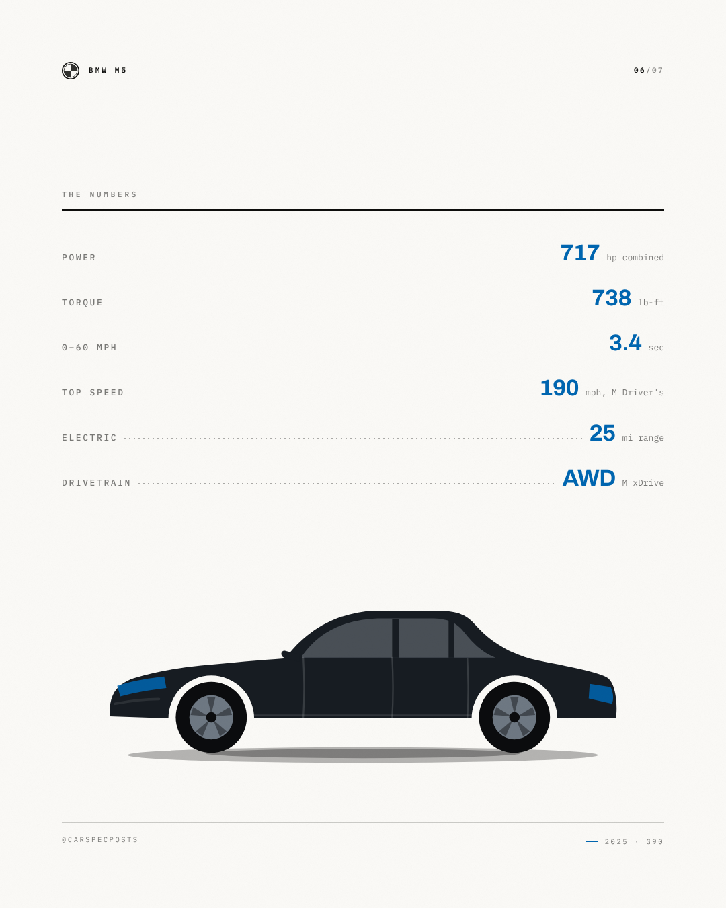
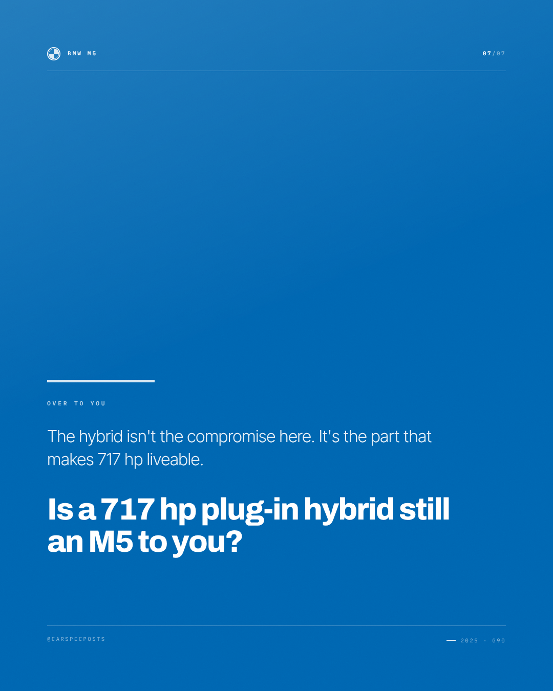

# BMW M5 — Instagram carousel

7 slides, 1080×1350 each, in order.

### Slide 1 — BMW M5

The numbers. BMW answered 717 horsepower with an electric motor inside the gearbox.

*Visual direction.* Cover: silhouette running off the right edge on the accent field, model name at slide scale, kicker as tracked caps above it.

### Slide 2 — 717 hp combined

717 hp combined and 738 lb-ft — a figure that needs both the V8 and the motor to reach it.

*Visual direction.* Point 1 of 4: heading at display scale over a hairline rule, body set narrow, slide index in the corner.

### Slide 3 — 3.4 seconds, 190 mph

3.4 seconds to 60 mph, and 190 mph with the M Driver’s Package.

*Visual direction.* Point 2 of 4: heading at display scale over a hairline rule, body set narrow, slide index in the corner.

### Slide 4 — 25 silent miles

25 miles of electric range: the school run and the commute, without the V8 waking up.

*Visual direction.* Point 3 of 4: heading at display scale over a hairline rule, body set narrow, slide index in the corner.

### Slide 5 — All four wheels, when asked

M xDrive sends it to all four wheels, and still lets you take the front axle out of the equation.

*Visual direction.* Point 4 of 4: heading at display scale over a hairline rule, body set narrow, slide index in the corner.

### Slide 6 — The numbers

717 hp combined / 738 lb-ft / 0–60 mph in 3.4 sec / 190 mph / 25 mi range / AWD M xDrive

*Visual direction.* Full spec table, dotted leaders, values in the accent colour.

### Slide 7 — Over to you

The hybrid isn't the compromise here. It's the part that makes 717 hp liveable. Is a 717 hp plug-in hybrid still an M5 to you?

*Visual direction.* Closer: accent field, question at display scale, handle in tracked caps at the foot.

## Review

- [x] Carousel of 5–10 slides — 7 slides
- [x] Slide titles within 34 characters — all slides
- [x] Slide bodies within 200 characters — all slides

### Read these yourself

- [ ] The hook earns the second line
- [ ] The tone reads as the effective tone above, not as the house voice
- [ ] Nothing here needs the poster in front of you to make sense
