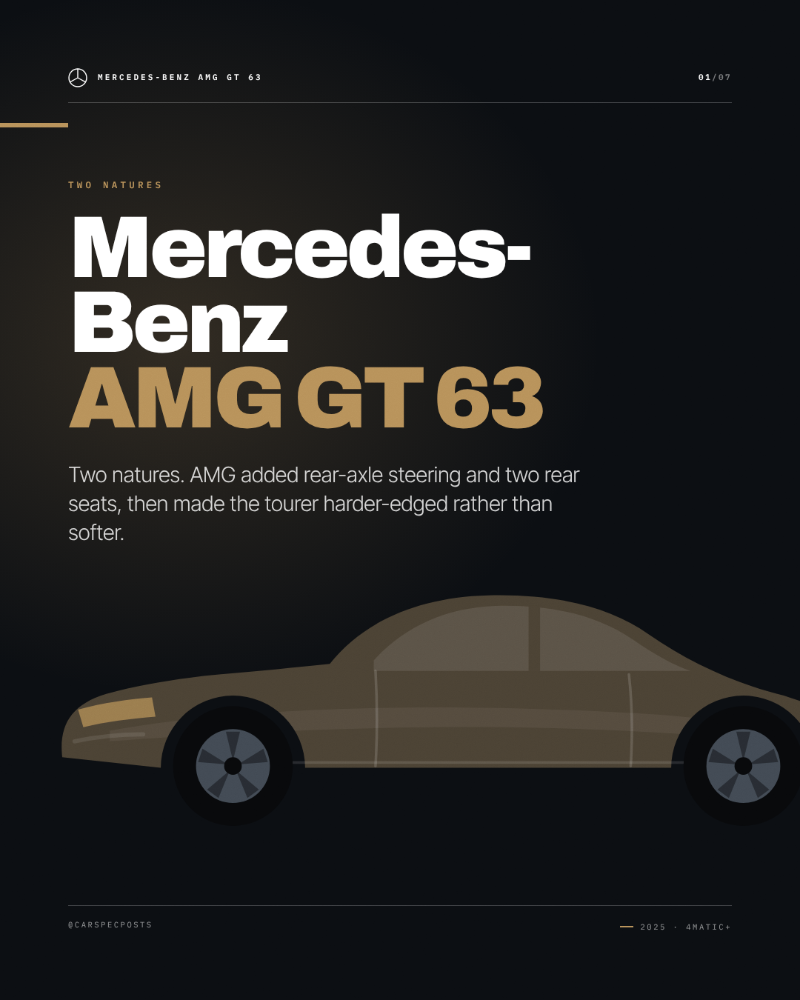
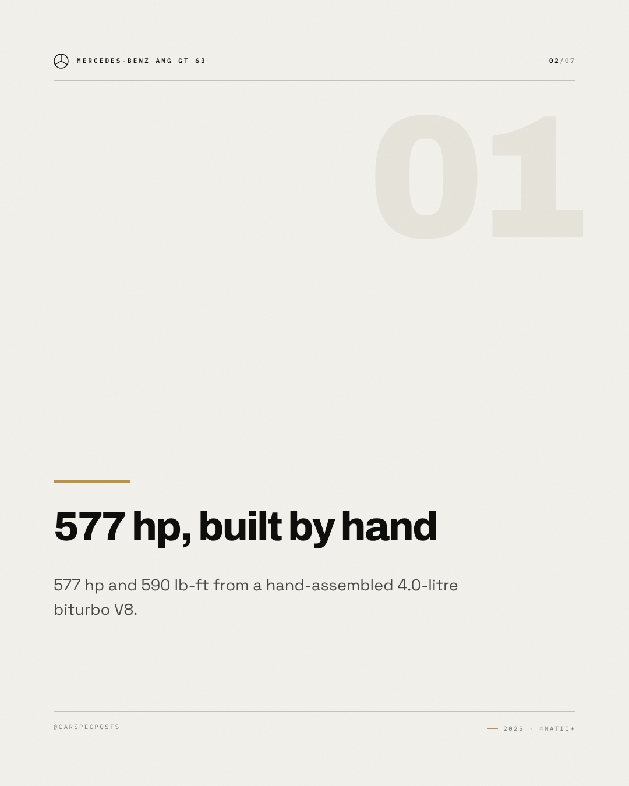
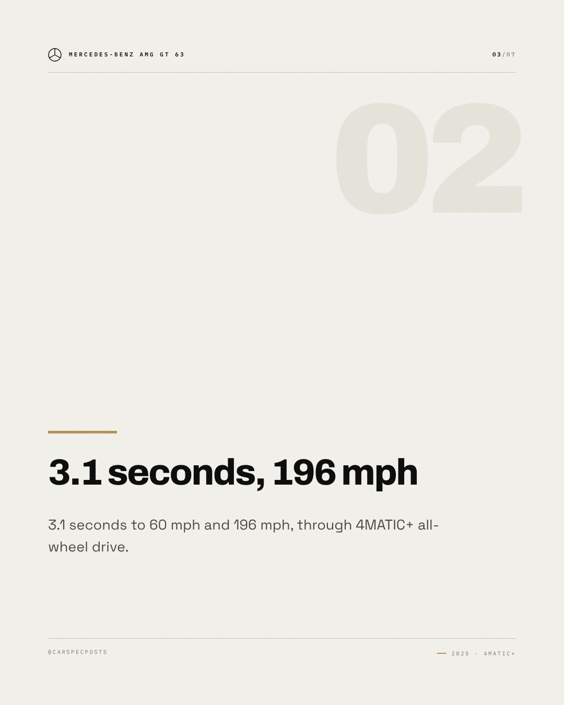
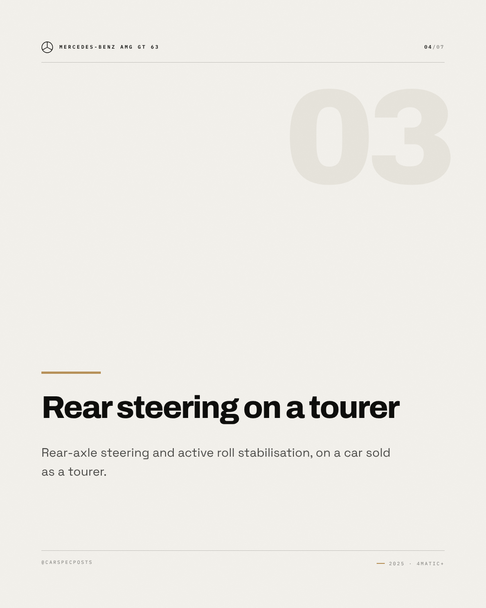
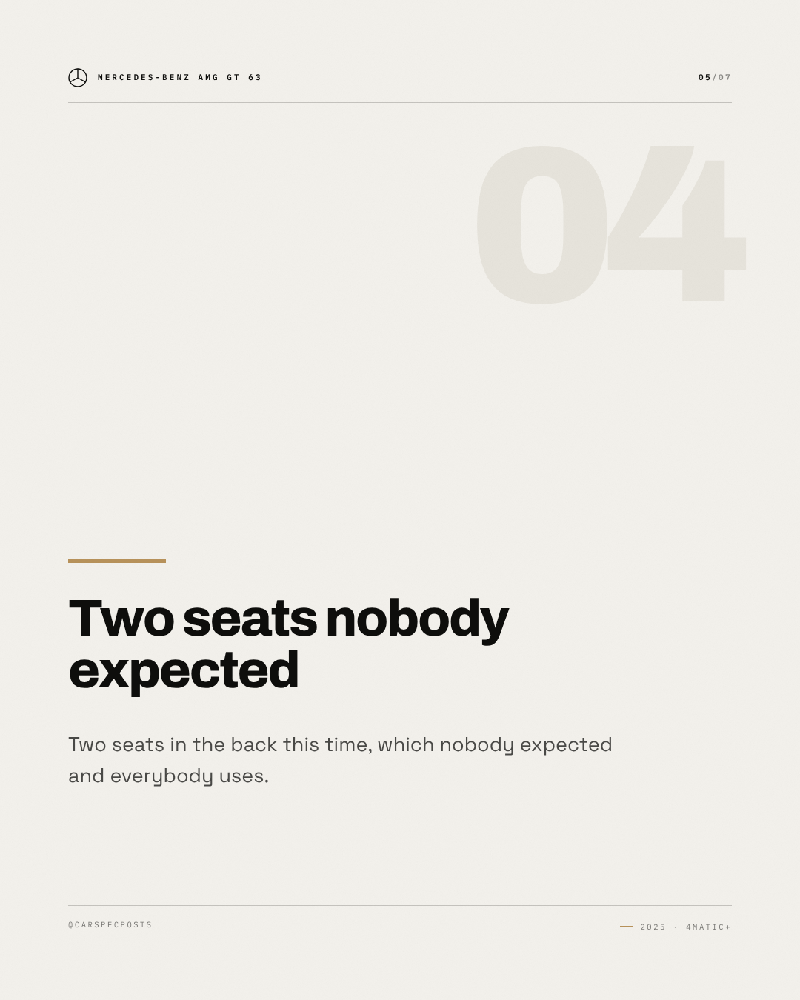
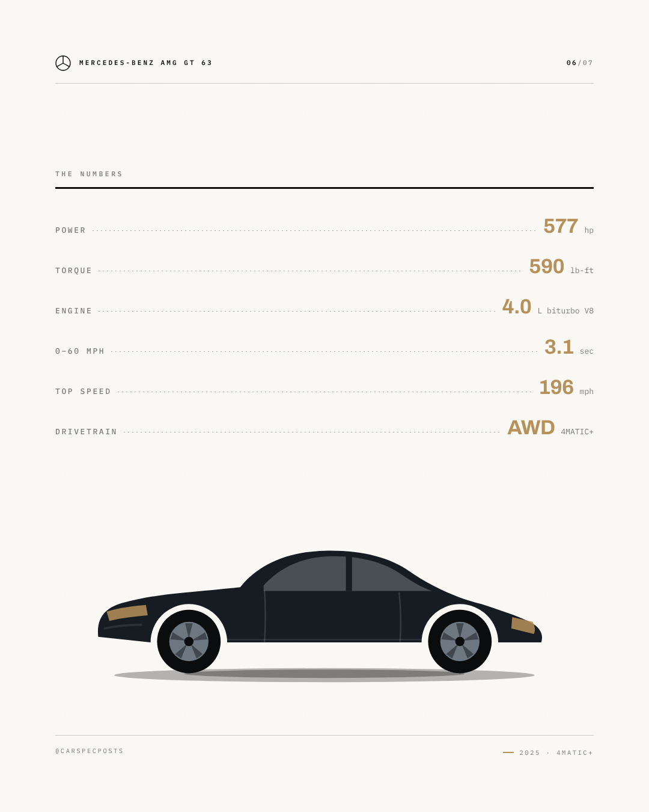
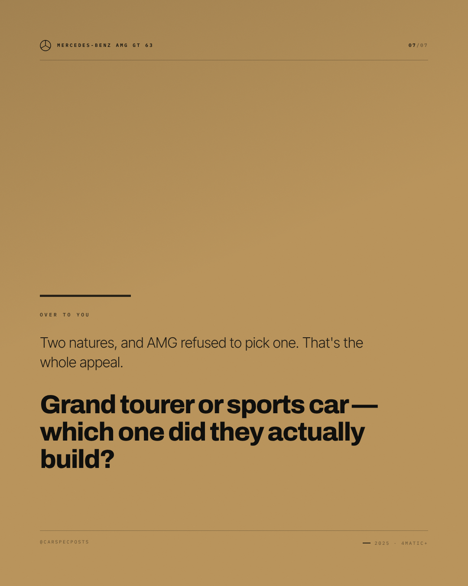

# Mercedes-Benz AMG GT 63 — Instagram carousel

7 slides, 1080×1350 each, in order.

### Slide 1 — Mercedes-Benz AMG GT 63

Two natures. AMG added rear-axle steering and two rear seats, then made the tourer harder-edged rather than softer.

*Visual direction.* Cover: silhouette running off the right edge on the accent field, model name at slide scale, kicker as tracked caps above it.

### Slide 2 — 577 hp, built by hand

577 hp and 590 lb-ft from a hand-assembled 4.0-litre biturbo V8.

*Visual direction.* Point 1 of 4: heading at display scale over a hairline rule, body set narrow, slide index in the corner.

### Slide 3 — 3.1 seconds, 196 mph

3.1 seconds to 60 mph and 196 mph, through 4MATIC+ all-wheel drive.

*Visual direction.* Point 2 of 4: heading at display scale over a hairline rule, body set narrow, slide index in the corner.

### Slide 4 — Rear steering on a tourer

Rear-axle steering and active roll stabilisation, on a car sold as a tourer.

*Visual direction.* Point 3 of 4: heading at display scale over a hairline rule, body set narrow, slide index in the corner.

### Slide 5 — Two seats nobody expected

Two seats in the back this time, which nobody expected and everybody uses.

*Visual direction.* Point 4 of 4: heading at display scale over a hairline rule, body set narrow, slide index in the corner.

### Slide 6 — The numbers

577 hp / 590 lb-ft / 4.0 L biturbo V8 / 0–60 mph in 3.1 sec / 196 mph / AWD 4MATIC+

*Visual direction.* Full spec table, dotted leaders, values in the accent colour.

### Slide 7 — Over to you

Two natures, and AMG refused to pick one. That's the whole appeal. Grand tourer or sports car — which one did they actually build?

*Visual direction.* Closer: accent field, question at display scale, handle in tracked caps at the foot.

## Review

- [x] Carousel of 5–10 slides — 7 slides
- [x] Slide titles within 34 characters — all slides
- [x] Slide bodies within 200 characters — all slides

### Read these yourself

- [ ] The hook earns the second line
- [ ] The tone reads as the effective tone above, not as the house voice
- [ ] Nothing here needs the poster in front of you to make sense
