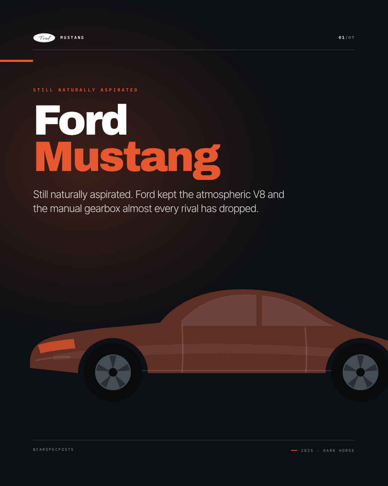
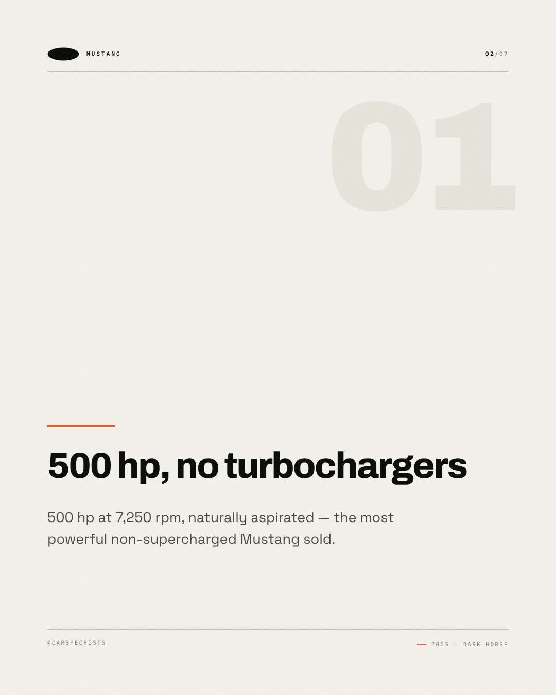
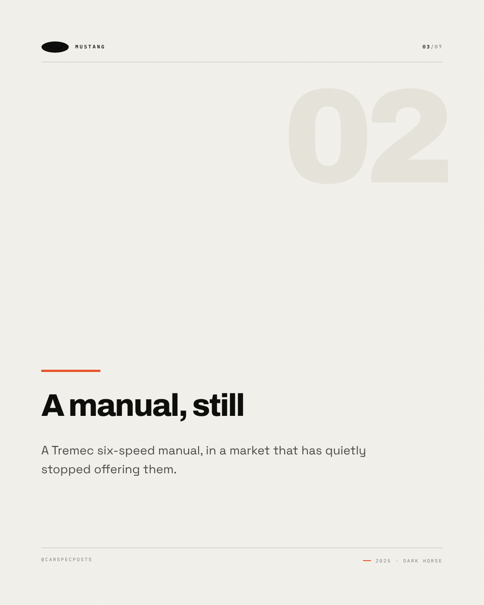
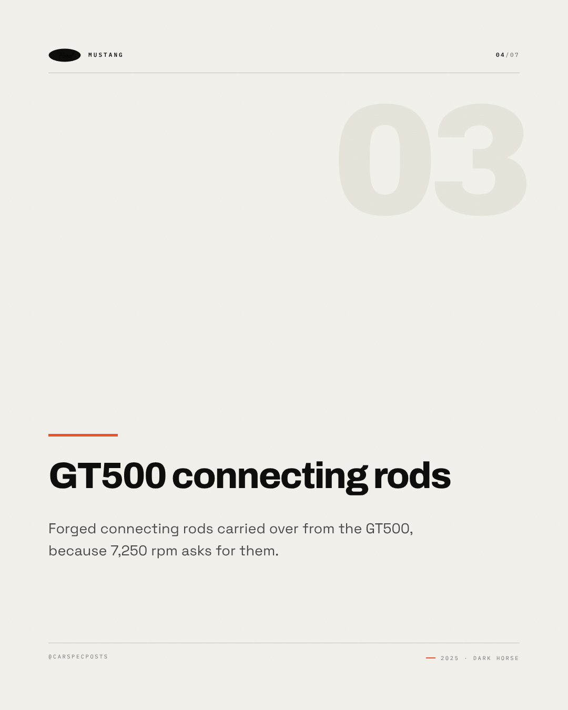
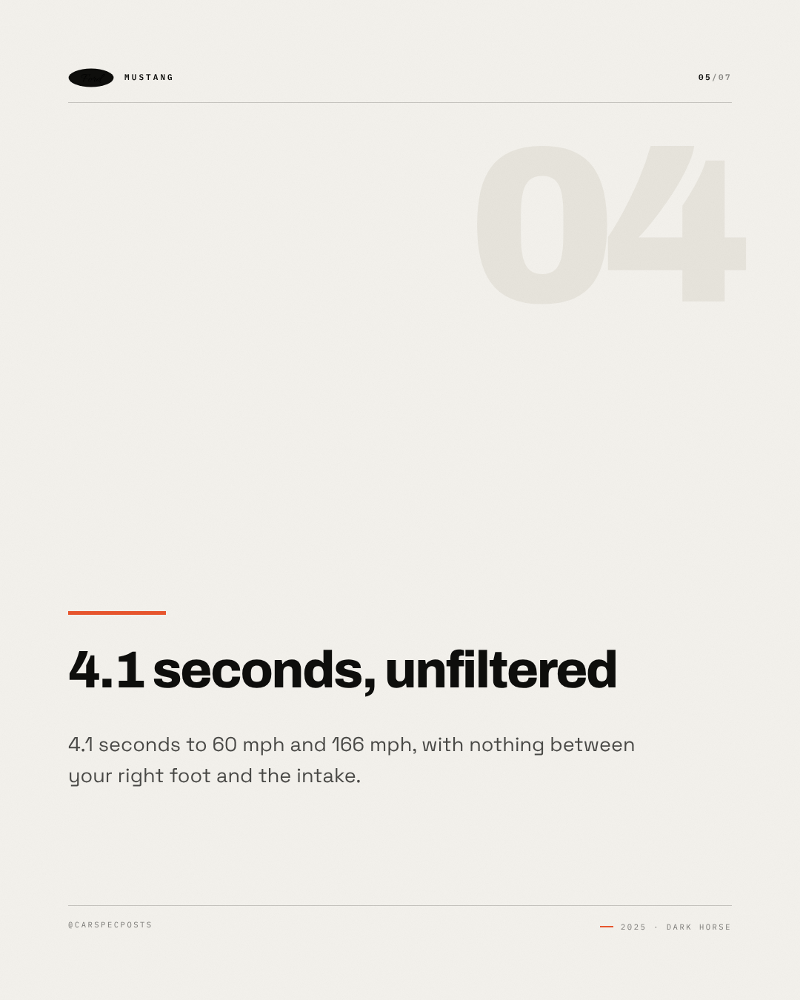
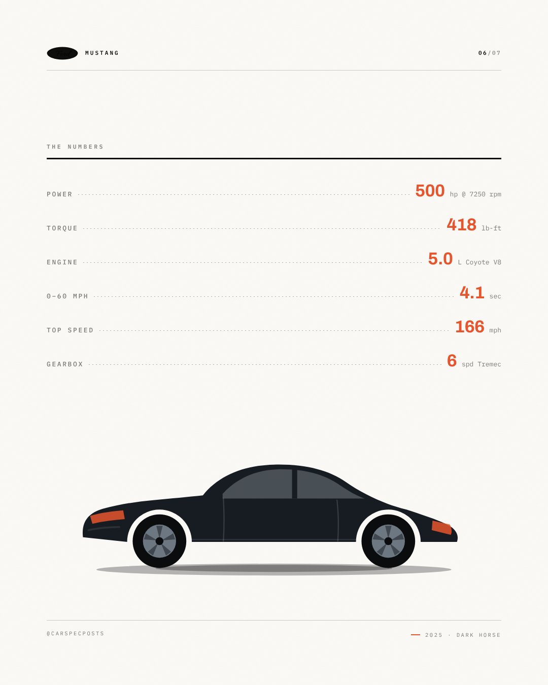
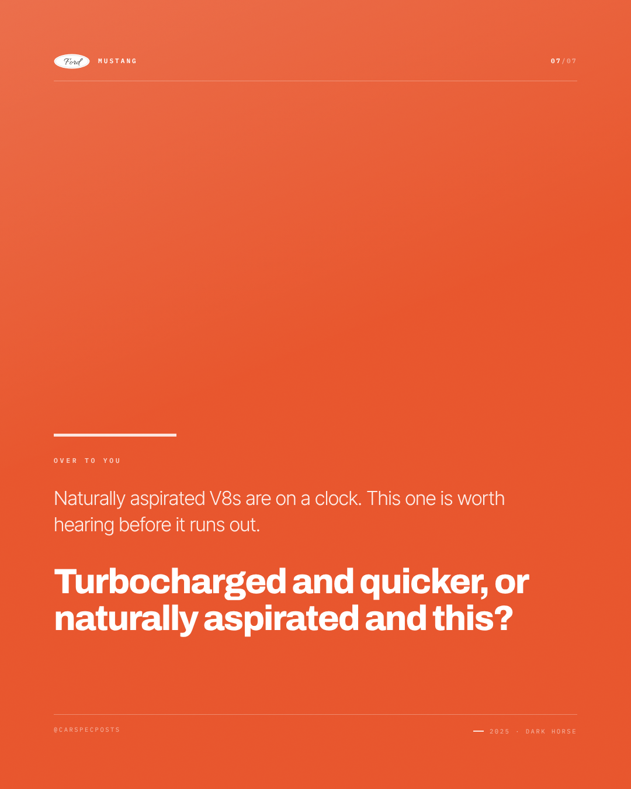

# Ford Mustang — Instagram carousel

7 slides, 1080×1350 each, in order.

### Slide 1 — Ford Mustang

Still naturally aspirated. Ford kept the atmospheric V8 and the manual gearbox almost every rival has dropped.

*Visual direction.* Cover: silhouette running off the right edge on the accent field, model name at slide scale, kicker as tracked caps above it.

### Slide 2 — 500 hp, no turbochargers

500 hp at 7,250 rpm, naturally aspirated — the most powerful non-supercharged Mustang sold.

*Visual direction.* Point 1 of 4: heading at display scale over a hairline rule, body set narrow, slide index in the corner.

### Slide 3 — A manual, still

A Tremec six-speed manual, in a market that has quietly stopped offering them.

*Visual direction.* Point 2 of 4: heading at display scale over a hairline rule, body set narrow, slide index in the corner.

### Slide 4 — GT500 connecting rods

Forged connecting rods carried over from the GT500, because 7,250 rpm asks for them.

*Visual direction.* Point 3 of 4: heading at display scale over a hairline rule, body set narrow, slide index in the corner.

### Slide 5 — 4.1 seconds, unfiltered

4.1 seconds to 60 mph and 166 mph, with nothing between your right foot and the intake.

*Visual direction.* Point 4 of 4: heading at display scale over a hairline rule, body set narrow, slide index in the corner.

### Slide 6 — The numbers

500 hp / 418 lb-ft / 5.0 L Coyote V8 / 0–60 mph in 4.1 sec / 166 mph / 6 spd Tremec

*Visual direction.* Full spec table, dotted leaders, values in the accent colour.

### Slide 7 — Over to you

Naturally aspirated V8s are on a clock. This one is worth hearing before it runs out. Turbocharged and quicker, or naturally aspirated and this?

*Visual direction.* Closer: accent field, question at display scale, handle in tracked caps at the foot.

## Review

- [x] Carousel of 5–10 slides — 7 slides
- [x] Slide titles within 34 characters — all slides
- [x] Slide bodies within 200 characters — all slides

### Read these yourself

- [ ] The hook earns the second line
- [ ] The tone reads as the effective tone above, not as the house voice
- [ ] Nothing here needs the poster in front of you to make sense
