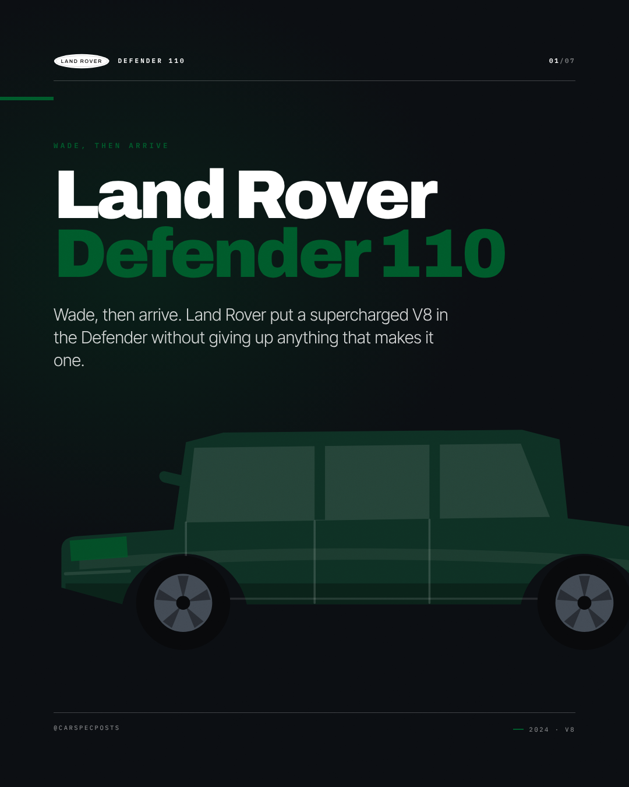
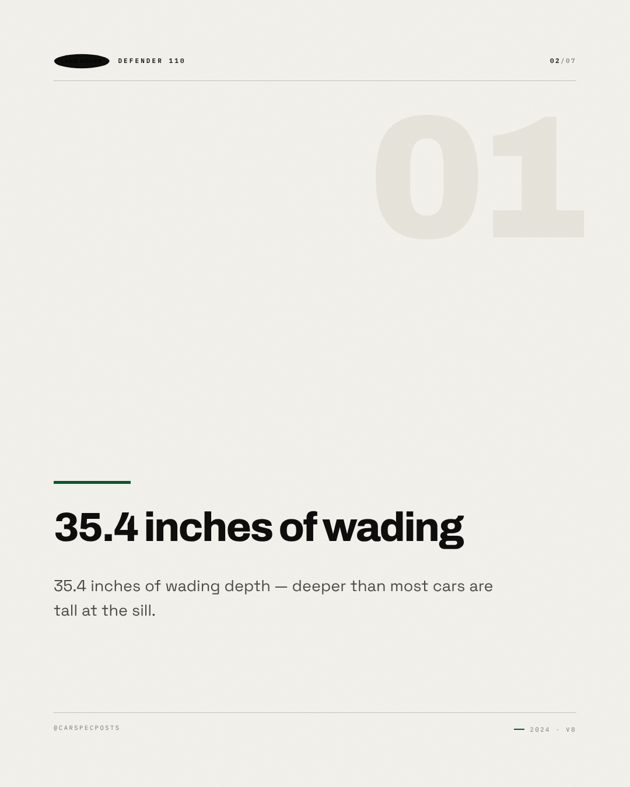
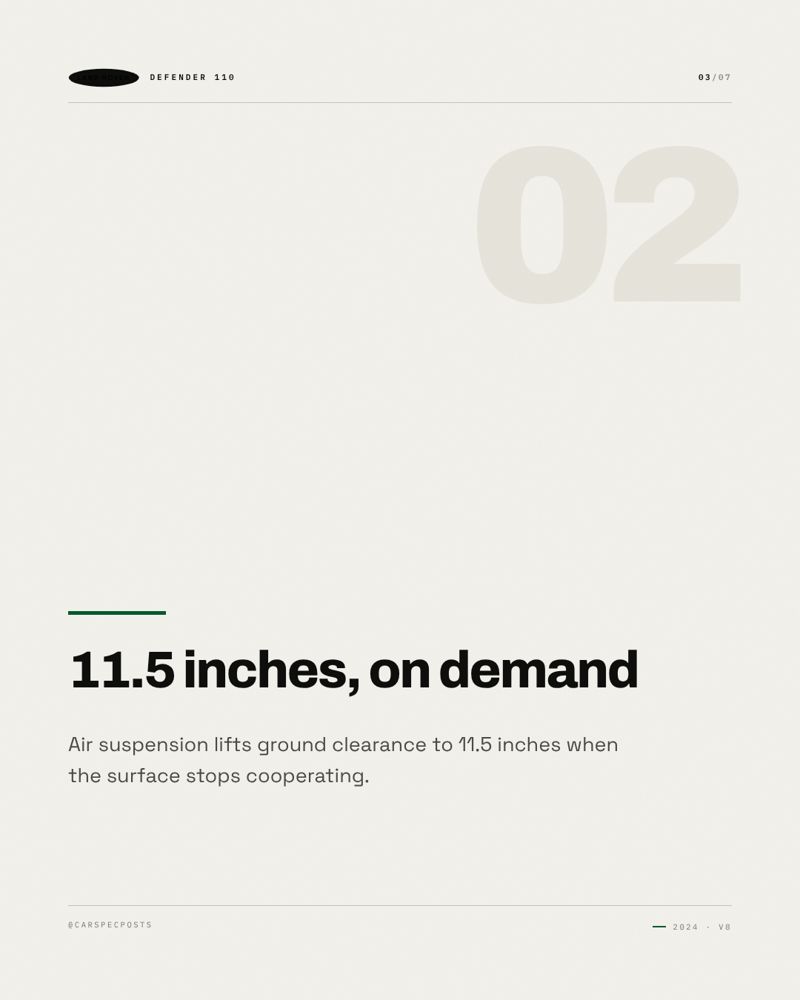
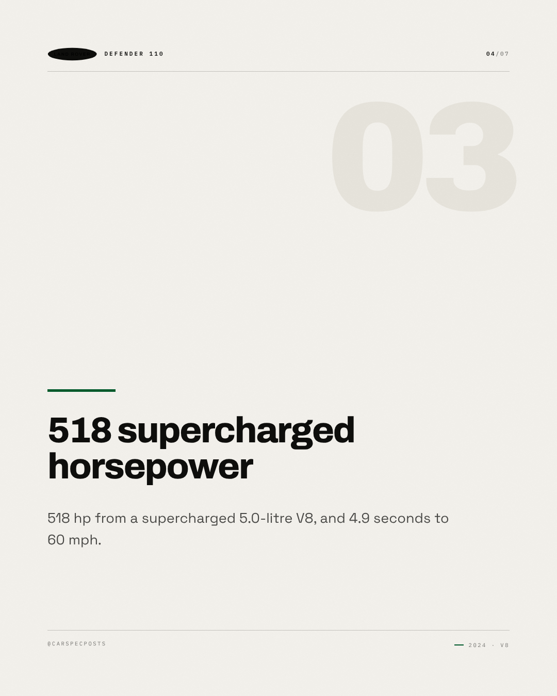
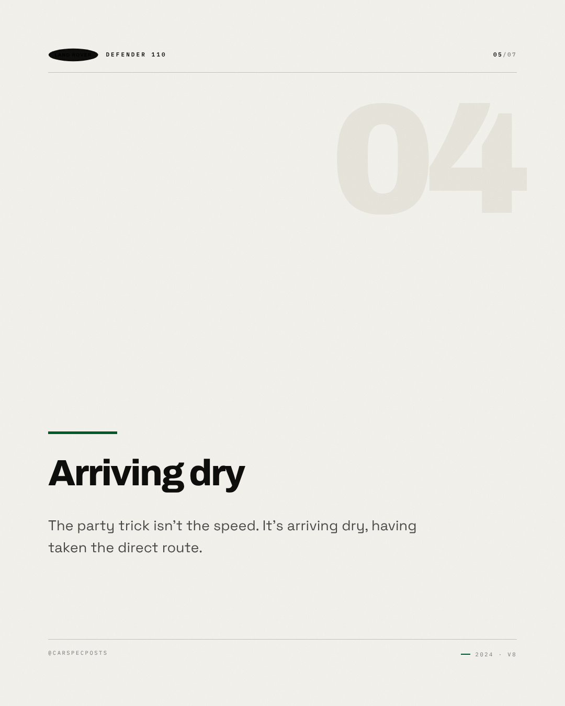
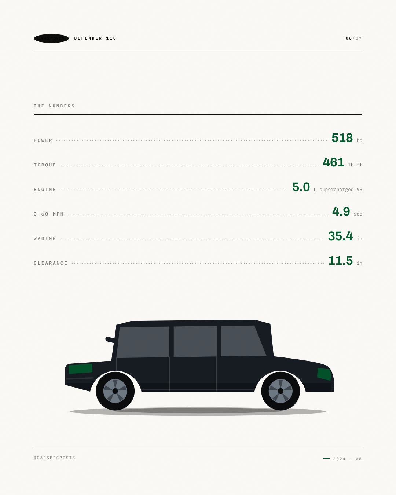
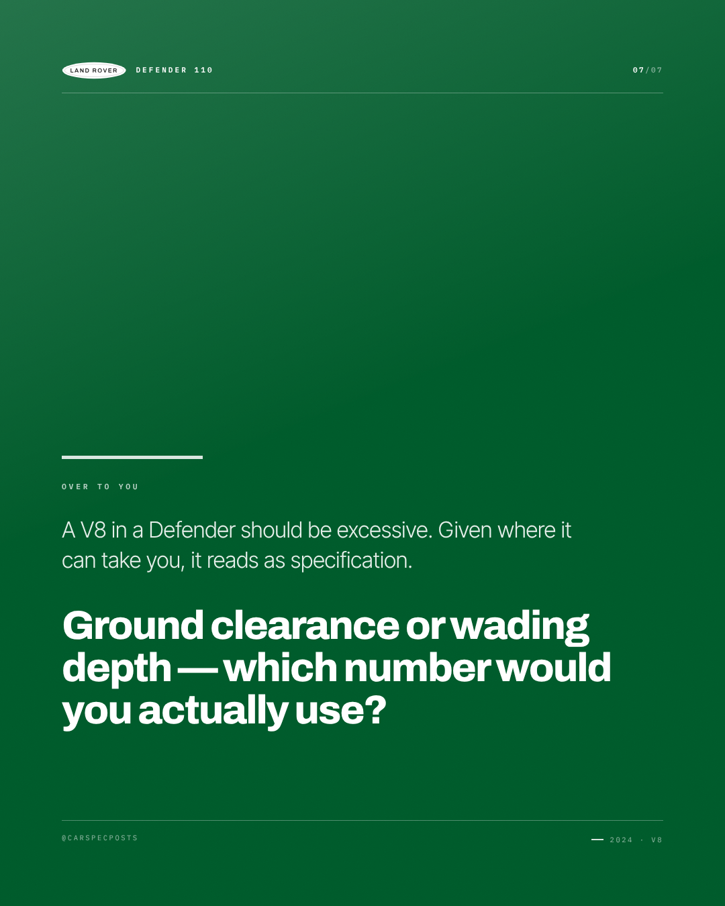

# Land Rover Defender 110 — Instagram carousel

7 slides, 1080×1350 each, in order.

### Slide 1 — Land Rover Defender 110

Wade, then arrive. Land Rover put a supercharged V8 in the Defender without giving up anything that makes it one.

*Visual direction.* Cover: silhouette running off the right edge on the accent field, model name at slide scale, kicker as tracked caps above it.

### Slide 2 — 35.4 inches of wading

35.4 inches of wading depth — deeper than most cars are tall at the sill.

*Visual direction.* Point 1 of 4: heading at display scale over a hairline rule, body set narrow, slide index in the corner.

### Slide 3 — 11.5 inches, on demand

Air suspension lifts ground clearance to 11.5 inches when the surface stops cooperating.

*Visual direction.* Point 2 of 4: heading at display scale over a hairline rule, body set narrow, slide index in the corner.

### Slide 4 — 518 supercharged horsepower

518 hp from a supercharged 5.0-litre V8, and 4.9 seconds to 60 mph.

*Visual direction.* Point 3 of 4: heading at display scale over a hairline rule, body set narrow, slide index in the corner.

### Slide 5 — Arriving dry

The party trick isn't the speed. It's arriving dry, having taken the direct route.

*Visual direction.* Point 4 of 4: heading at display scale over a hairline rule, body set narrow, slide index in the corner.

### Slide 6 — The numbers

518 hp / 461 lb-ft / 5.0 L supercharged V8 / 0–60 mph in 4.9 sec / 35.4 in / 11.5 in

*Visual direction.* Full spec table, dotted leaders, values in the accent colour.

### Slide 7 — Over to you

A V8 in a Defender should be excessive. Given where it can take you, it reads as specification. Ground clearance or wading depth — which number would you actually use?

*Visual direction.* Closer: accent field, question at display scale, handle in tracked caps at the foot.

## Review

- [x] Carousel of 5–10 slides — 7 slides
- [x] Slide titles within 34 characters — all slides
- [x] Slide bodies within 200 characters — all slides

### Read these yourself

- [ ] The hook earns the second line
- [ ] The tone reads as the effective tone above, not as the house voice
- [ ] Nothing here needs the poster in front of you to make sense
