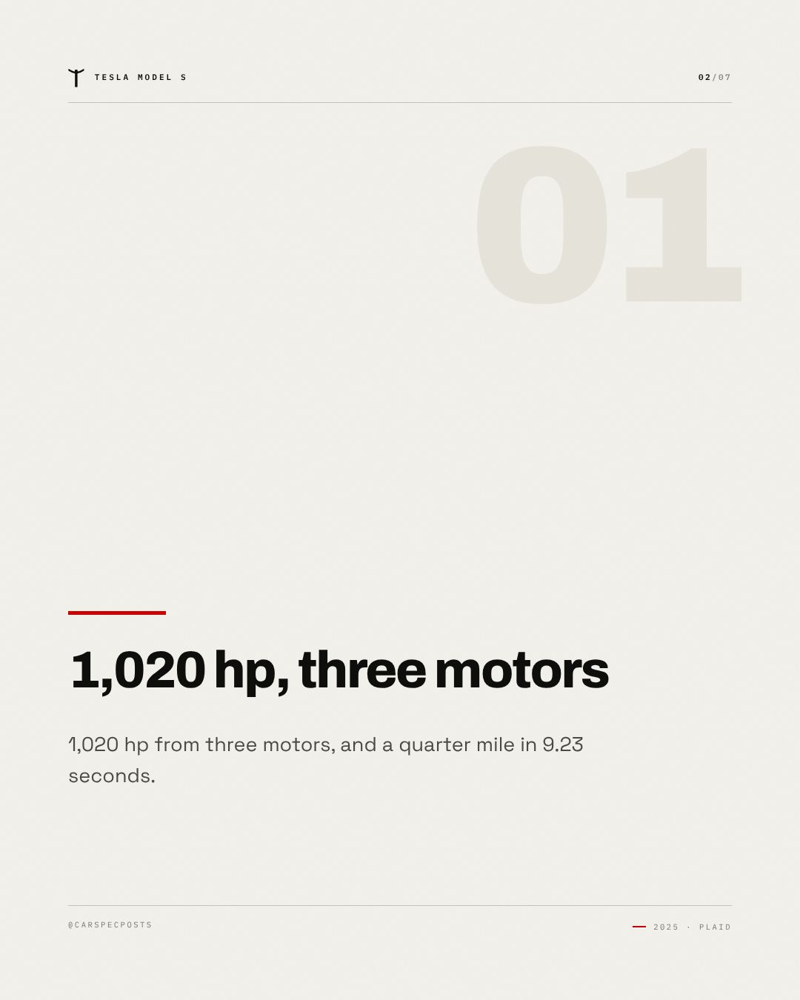
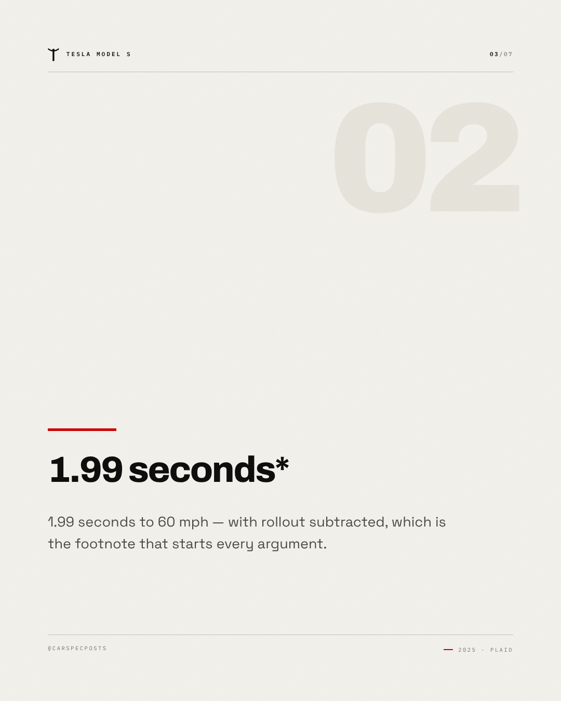
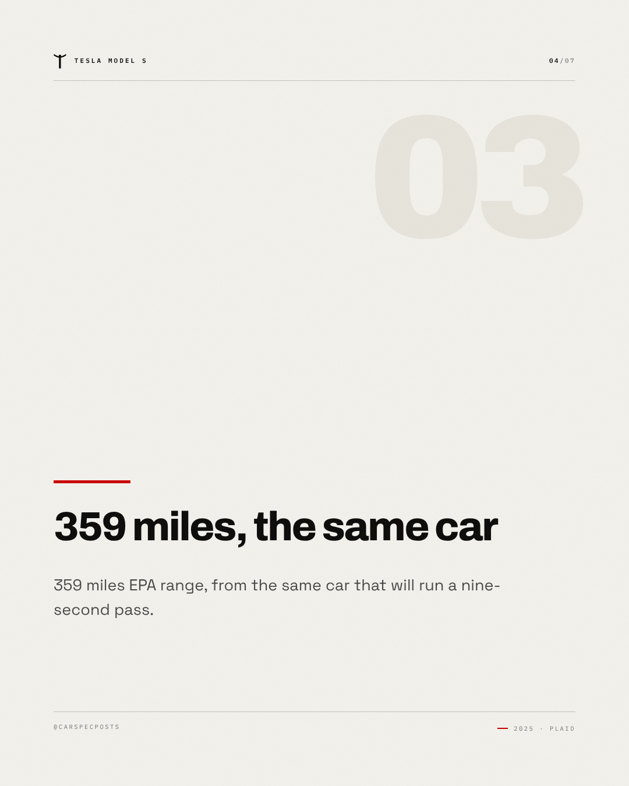
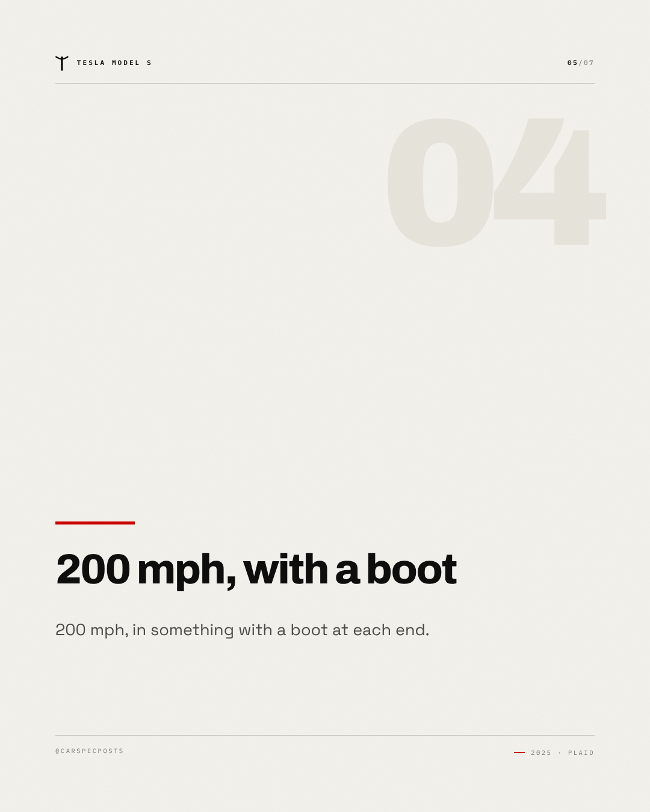
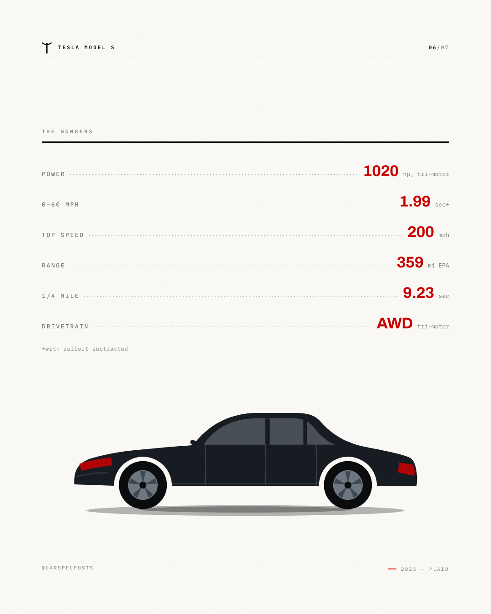
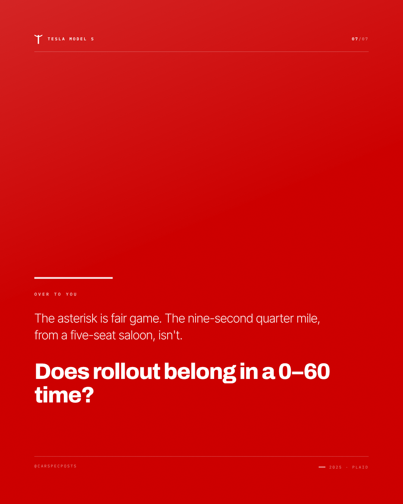

# Tesla Model S — Instagram carousel

7 slides, 1080×1350 each, in order.

### Slide 1 — Tesla Model S

Delivery ticket. A saloon that runs the quarter mile in the nines and still takes four adults and the luggage.

*Visual direction.* Cover: silhouette running off the right edge on the accent field, model name at slide scale, kicker as tracked caps above it.

### Slide 2 — 1,020 hp, three motors

1,020 hp from three motors, and a quarter mile in 9.23 seconds.

*Visual direction.* Point 1 of 4: heading at display scale over a hairline rule, body set narrow, slide index in the corner.

### Slide 3 — 1.99 seconds*

1.99 seconds to 60 mph — with rollout subtracted, which is the footnote that starts every argument.

*Visual direction.* Point 2 of 4: heading at display scale over a hairline rule, body set narrow, slide index in the corner.

### Slide 4 — 359 miles, the same car

359 miles EPA range, from the same car that will run a nine-second pass.

*Visual direction.* Point 3 of 4: heading at display scale over a hairline rule, body set narrow, slide index in the corner.

### Slide 5 — 200 mph, with a boot

200 mph, in something with a boot at each end.

*Visual direction.* Point 4 of 4: heading at display scale over a hairline rule, body set narrow, slide index in the corner.

### Slide 6 — The numbers

1020 hp / 0–60 mph in 1.99 sec* / 200 mph / 359 mi EPA / 9.23 sec / AWD tri-motor

*Visual direction.* Full spec table, dotted leaders, values in the accent colour.

### Slide 7 — Over to you

The asterisk is fair game. The nine-second quarter mile, from a five-seat saloon, isn't. Does rollout belong in a 0–60 time?

*Visual direction.* Closer: accent field, question at display scale, handle in tracked caps at the foot.

## Review

- [x] Carousel of 5–10 slides — 7 slides
- [x] Slide titles within 34 characters — all slides
- [x] Slide bodies within 200 characters — all slides

### Read these yourself

- [ ] The hook earns the second line
- [ ] The tone reads as the effective tone above, not as the house voice
- [ ] Nothing here needs the poster in front of you to make sense
